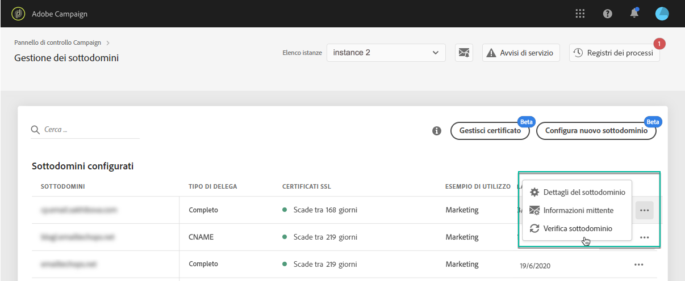

# Monitorare i sottodomini {#monitoring-subdomains}

È essenziale monitorare i sottodomini per assicurarsi che siano tutti configurati correttamente per funzionare con Adobe Campaign.

L’elenco dei sottodomini per ciascuna istanza di produzione è accessibile direttamente quando si seleziona la **[!UICONTROL Subdomains & Certificates]** Card.

Il **[!UICONTROL Last verification]** indica quando un sottodominio è stato verificato per l’ultima volta. Puoi avviare una verifica in qualsiasi momento facendo clic sul pulsante **...** / **[!UICONTROL Verify subdomain]** pulsante.

>[!IMPORTANT]
>
>L’Adobe non consiglia di utilizzare sottodomini senza data di certificato, in quanto potrebbe indicare che questi sottodomini potrebbero presentare alcuni problemi di recapito messaggi.

Quando si avvia una verifica, vengono eseguite diverse operazioni per verificare che il sottodominio sia configurato correttamente (controllo del tenant dell’istanza, test di invio e-mail, ecc.) Se la verifica del sottodominio non riesce, contatta l’Assistenza clienti Adobe per ulteriori indagini.

**Argomenti correlati:**

* [Rinnovo del certificato SSL di un sottodominio](../../subdomains-certificates/using/renewing-subdomain-certificate.md)
* [Branding dei sottodomini](../../subdomains-certificates/using/subdomains-branding.md)
