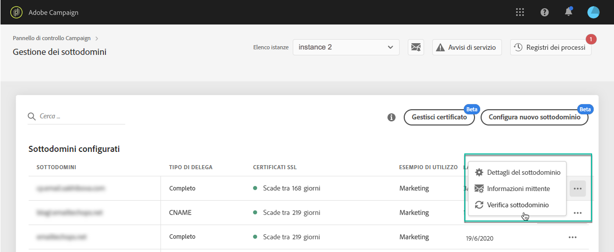

# Monitorare i sottodomini {#monitoring-subdomains}

È essenziale monitorare i sottodomini per assicurarsi che siano tutti configurati correttamente per funzionare con Adobe Campaign.

L’elenco dei sottodomini per ciascuna istanza di produzione è accessibile direttamente quando si seleziona la scheda **[!UICONTROL Sottodomini e certificati]**.

La colonna **[!UICONTROL Ultima verifica]** indica quando un sottodominio è stato verificato per l’ultima volta. Puoi avviare una verifica in qualsiasi momento facendo clic sul pulsante **...** / **[!UICONTROL Verifica sottodominio]**.

>[!IMPORTANT]
>
>Adobe non consiglia di utilizzare sottodomini senza data di certificato, in quanto questo potrebbe indicare la presenza di problemi di recapitabilità in questi sottodomini.

All’avvio di una verifica, vengono eseguite diverse operazioni per accertarsi che il sottodominio sia configurato correttamente (controllo del tenant dell’istanza, test di invio e-mail, ecc.). Se la verifica del sottodominio non riesce, contatta l’Assistenza clienti di Adobe per ulteriori indagini.

**Argomenti correlati:**

* [Rinnovo del certificato SSL di un sottodominio](../../subdomains-certificates/using/renewing-subdomain-certificate.md)
* [Branding dei sottodomini](../../subdomains-certificates/using/subdomains-branding.md)
