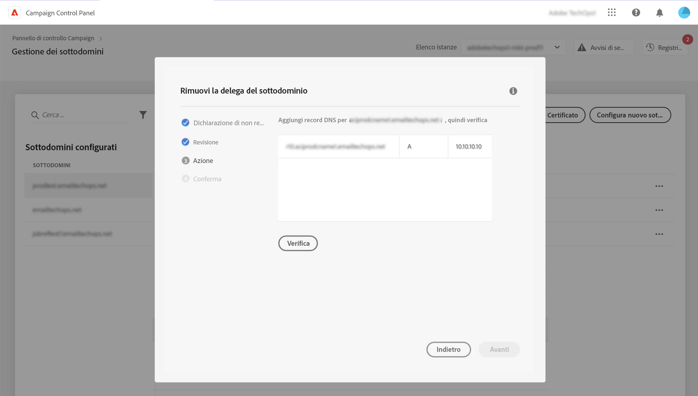

# Rimuovi la delega dei sottodomini ad Adobe {#remove-delegated--subdomains}

>[!CONTEXTUALHELP]
>id="cp_subdomain_undelegate"
>title="Rimuovi la delega del sottodominio"
>abstract="Questa schermata ti consente di rimuovere la delega di un sottodominio ad Adobe. Tieni presente che questo processo non può essere annullato ed è irreversibile fino al completamento della sua esecuzione.  Se stai tentando di rimuovere la delega di un dominio primario per l’istanza selezionata, ti verrà chiesto di scegliere il dominio sostitutivo."

Il Pannello di controllo ti consente di rimuovere la delega di un sottodominio completamente delegato ad Adobe o delegato tramite CNAME.

## Note importanti {#important}

Prima di procedere, considera attentamente gli impatti che si verificano una volta attivato il processo di rimozione:

* Una volta attivato il processo, la rimozione della delega del sottodominio non può essere annullata ed è irreversibile fino al completamento dell’esecuzione del processo.
* Nessun’altra delega di sottodominio può essere rimossa quando è in corso un processo simile in un altro sottodominio.
* Una delega rimossa in un sottodominio non può essere ridelegata fino a 3 giorni dalla sua rimozione.

## Rimuovi la delega del sottodominio {#steps}

Per rimuovere la delega di un sottodominio ad Adobe, effettua le seguenti operazioni:

1. Fai clic sul pulsante con i puntini di sospensione accanto alla delega di dominio da rimuovere e seleziona **[!UICONTROL Rimuovi delega]**.

   

1. Rivedi la liberatoria e conferma la rimozione della delega del dominio ad Adobe.

1. Rivedi le informazioni relative all’istanza a cui è associato il sottodominio, incluse le affinità IP e le configurazioni del brand correlate.

   Se rimuovi la delega del dominio principale per l’istanza selezionata, devi scegliere il dominio che lo sostituirà dall’elenco **[!UICONTROL Dominio di sostituzione]**.

   Fai clic su **[!UICONTROL Avanti]** per procedere alla rimozione.

   

1. Se rimuovi una delega di tipo CNAME o sostituisci un dominio principale con un dominio delegato tramite CNAME, viene visualizzato un ulteriore passaggio **[!UICONTROL Azione]** per gestire i record DNS. [Per ulteriori informazioni, consulta questa sezione](#dns)

1. Esamina il riepilogo visualizzato. Per confermare la rimozione, digita l’URL del dominio per il quale vuoi rimuovere la delega e fai clic su **[!UICONTROL Invia]**.

   

Dopo l’avvio della rimozione della delega, il processo in sospeso viene visualizzato nei registri dei processi fino al suo completamento.

## Gestione dei record DNS {#dns}

Per configurare una delega di dominio tramite CNAME, il Pannello di controllo richiede l’aggiunta di record specifici sul server DNS. [Scopri come impostare i sottodomini tramite CNAME](setting-up-new-subdomain.md#use-cnames)

Quando rimuovi una delega di tipo CNAME, devi **rimuovere questi record DNS** dal server per evitare qualsiasi problema. Inoltre, se desideri rimuovere la delega di un sottodominio primario e sostituirla con un dominio delegato tramite CNAME, potrebbe essere necessario **aggiungere record DNS** sul server, a seconda delle affinità IP impostate per il sottodominio.

Nella tabella seguente sono elencate le azioni da eseguire a seconda del tipo di delega che stai rimuovendo e del tipo di delega utilizzato per impostare il dominio di sostituzione.

| Delega rimossa | Delega dominio di sostituzione | Azione richiesta |
|  ---  |  ---  |  ---  |
| CNAME | Nessun dominio di sostituzione | Elimina record DNS |
| CNAME | CNAME | Elimina record DNS Aggiungi record DNS *(facoltativo a seconda delle affinità IP)* |
| CNAME | Completo | Elimina record DNS |
| Completo | Nessun dominio di sostituzione | Nessuna azione richiesta |
| Completo | CNAME | Aggiungi record DNS *(facoltativo a seconda delle affinità IP)* |
| Completo | Completo | Nessuna azione richiesta |

{style="table-layout:auto"}

Se è necessaria una di queste azioni per rimuovere la delega, un ulteriore passaggio **[!DNL Action]** viene visualizzato prima di confermare la rimozione della delega. In questa schermata vengono elencati i record DNS da rimuovere o aggiungere, a seconda del contesto.

### Elimina record DNS

1. Passa al server DNS e rimuovi i record elencati in Pannello di controllo.
1. Torna al Pannello di controllo e fai clic su **[!UICONTROL Avanti]** per procedere alla rimozione della delega.

### Aggiungi record DNS

1. Passa al server DNS e aggiungi i record elencati nel Pannello di controllo.
1. Attendi che l’aggiunta al DNS sia efficace.
1. Torna al Pannello di controllo e fai clic su **[!UICONTROL Verifica]**.
1. Una volta verificata correttamente l’aggiunta dei record, fai clic su **[!UICONTROL Avanti]** per procedere alla rimozione della delega.

## Codici di errore {#FAQ}

In questa sezione sono elencati i messaggi di errore che possono verificarsi quando si tenta di rimuovere la delega di un sottodominio:

| Codice errore | Messaggio | Descrizione |
|  ---  |  ---  |  ---  |
| 8002 | La rimozione del dominio delegato richiesta non può essere effettuata perché è in corso una richiesta simile in sovrapposizione. Riprova dopo 3 giorni | È già in corso un processo di rimozione della delega di sottodominio per l’istanza selezionata. Attendi 3 giorni per avviare un nuovo processo di rimozione. |
| 8003 | La rimozione del dominio delegato richiesta non è supportata per questa istanza. | La rimozione della delega non è supportata per il sottodominio selezionato a causa di un problema tecnico. Rivolgiti all’Assistenza clienti. |
| 8004 | La rimozione del dominio delegato richiesta non è consentita in quanto in questa istanza è presente un solo dominio. | È stato delegato un solo sottodominio per l’istanza selezionata. La rimozione della delega non è consentita. |
| 8005 | La rimozione del dominio delegato richiesta non è supportata per questa configurazione. | La rimozione della delega non è supportata per il sottodominio selezionato a causa di un problema tecnico. Rivolgiti all’Assistenza clienti. |
| 8006 | La rimozione del dominio delegato richiesta non è consentita per motivi sconosciuti. Contatta l’assistenza clienti. | La rimozione della delega non è supportata per l’istanza selezionata a causa di problemi sconosciuti. Rivolgiti all’assistenza clienti. |
