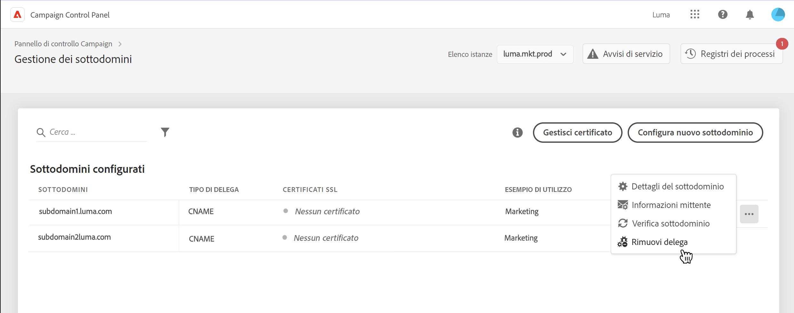
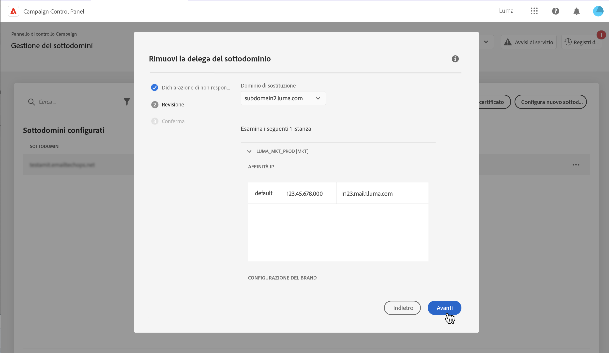
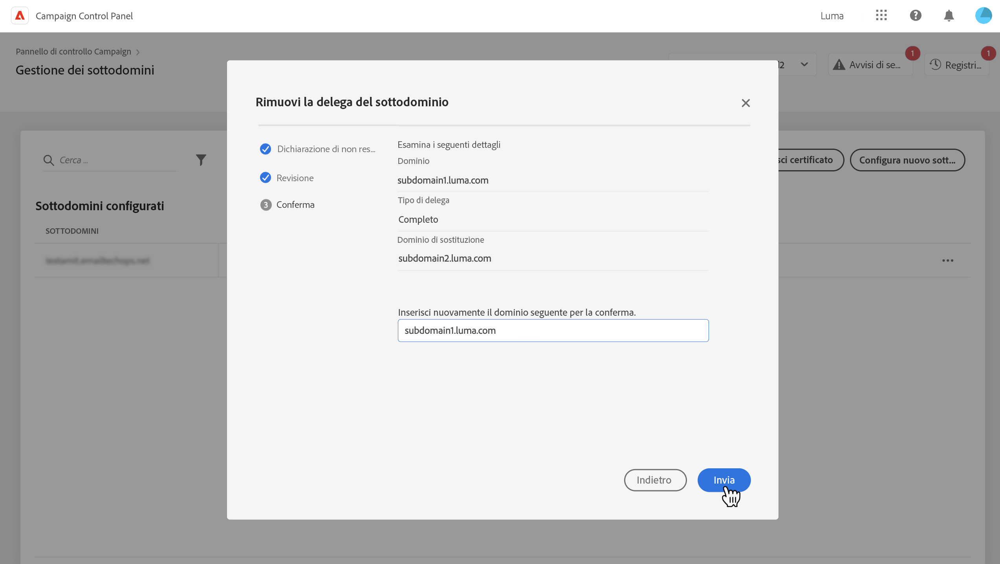
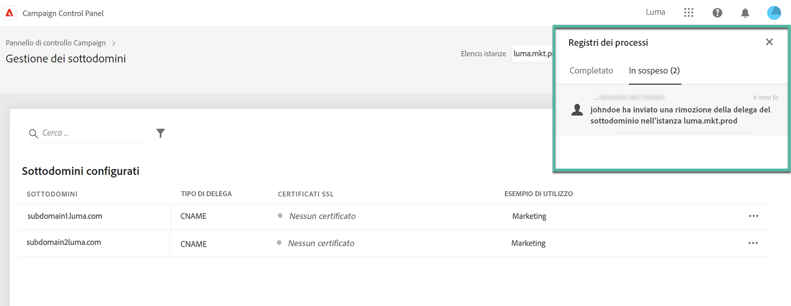

# Rimuovi la delega dei sottodomini ad Adobe {#remove-delegated--subdomains}

>[!CONTEXTUALHELP]
>id="cp_subdomain_undelegate"
>title="Rimuovi delega sottodominio"
>abstract="Questa schermata ti consente di rimuovere ad Adobe la delega di un sottodominio. Tieni presente che questo processo non può essere annullato o interrotto una volta inviato.  Se stai tentando di rimuovere la delega di un dominio primario per l&#39;istanza selezionata, ti verrà chiesto di scegliere il dominio che la sostituirà."

Il Pannello di controllo Campaign ti consente di rimuovere la delega di un sottodominio delegato ad Adobe, inclusa la configurazione CNAME.

## Note importanti {#important}

Prima di procedere, considera attentamente gli impatti che si verificano quando viene attivato il processo di rimozione:

* La rimozione della delega del sottodominio non può essere annullata e sarà irreversibile una volta avviata l’esecuzione del processo.
* Non è possibile rimuovere alcuna delega di sottodominio quando è in corso un processo simile su un altro sottodominio.
* Una delega rimossa su un sottodominio non può essere nuovamente delegata fino a 3 giorni dalla sua rimozione.

## Rimuovere una delega di sottodominio {#steps}

Per rimuovere ad Adobe la delega di un sottodominio, effettua le seguenti operazioni:

1. Fai clic sul pulsante dei puntini di sospensione accanto alla delega del dominio che desideri rimuovere e seleziona **[!UICONTROL Remove delegated subdomain]**.

   

1. Rivedi la liberatoria e riconosce la rimozione della delega del dominio ad Adobe.

1. Rivedi le informazioni relative all’istanza a cui è associato il sottodominio, incluse le relative affinità IP e le configurazioni del marchio.

   Se stai rimuovendo la delega del dominio principale per l’istanza selezionata, devi scegliere il dominio che la sostituirà utilizzando il **[!UICONTROL Replacement Domain]** elenco.

   Fai clic su **[!UICONTROL Next]** procedere alla rimozione.

   

1. Rivedi il riepilogo visualizzato. Per confermare la rimozione, digita l’URL del dominio per il quale vuoi rimuovere la delega e fai clic su **[!UICONTROL Submit]**.

   

Dopo l&#39;avvio della rimozione della delega, il processo in sospeso viene visualizzato nei registri dei processi fino al completamento.

## Codici di errore {#FAQ}

In questa sezione sono elencati i messaggi di errore che si possono incontrare durante il tentativo di rimuovere la delega di un sottodominio:

| Codice errore | Messaggio | Descrizione |
|  ---  |  ---  |  ---  |
| 8002 | Impossibile risolvere la rimozione del dominio delegato richiesto perché è in corso una richiesta di sovrapposizione simile. Riprovare dopo 3 giorni | È già in corso un processo di rimozione di una delega di sottodominio per l’istanza selezionata. Attendere fino a 3 giorni per avviare un nuovo processo di rimozione. |
| 8003 | La rimozione del dominio delegato richiesto non è supportata per questa istanza. | La rimozione della delega non è supportata per il sottodominio selezionato a causa di un problema tecnico, rivolgiti all’Assistenza clienti. |
| 8004 | La rimozione del dominio delegato richiesto non è consentita perché in questa istanza è presente un solo dominio. | È stato delegato un solo sottodominio per l’istanza selezionata. Rimozione delega non consentita. |
| 8005 | La rimozione del dominio delegato richiesto non è supportata per questa configurazione. | La rimozione della delega non è supportata per il sottodominio selezionato a causa di un problema tecnico, rivolgiti all’Assistenza clienti. |
| 8006 | La rimozione del dominio delegato richiesto non è consentita a causa di motivi sconosciuti. Contatta l&#39;assistenza clienti. | La rimozione della delega non è supportata per l’istanza selezionata a causa di problemi sconosciuti, rivolgiti all’Assistenza clienti. |
