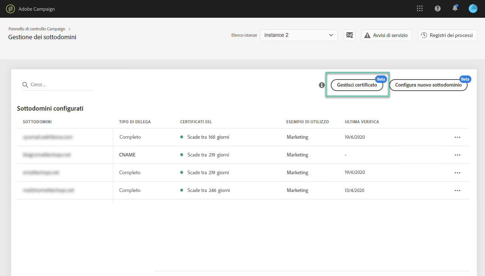
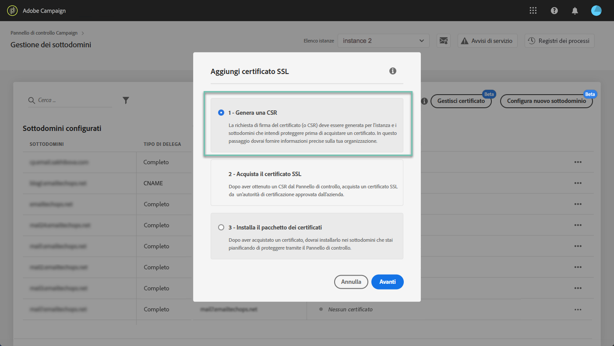
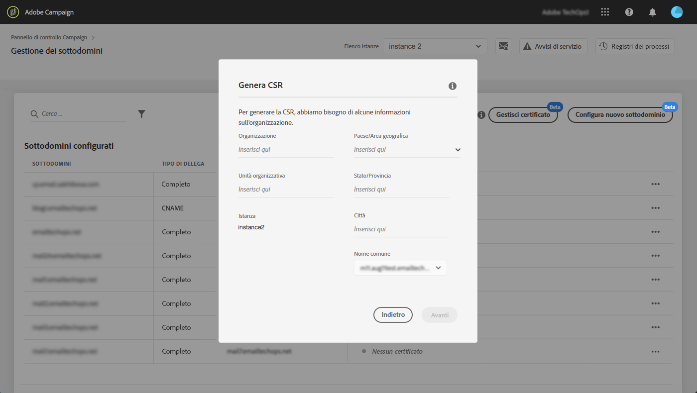
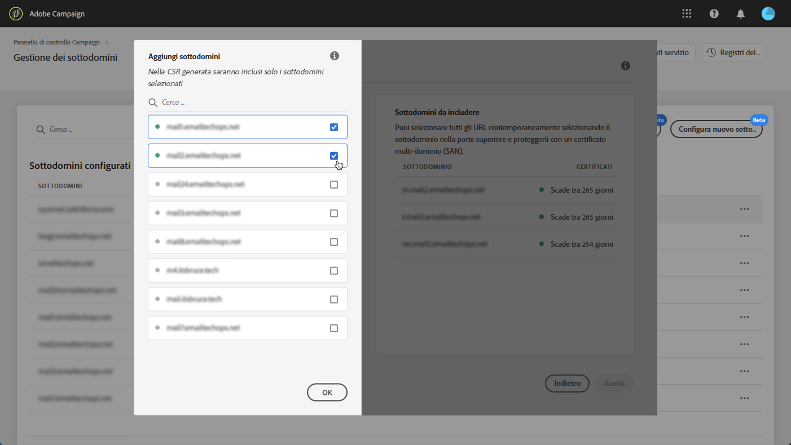
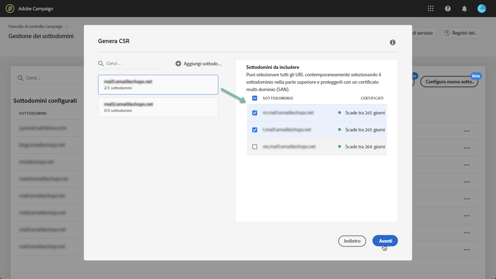
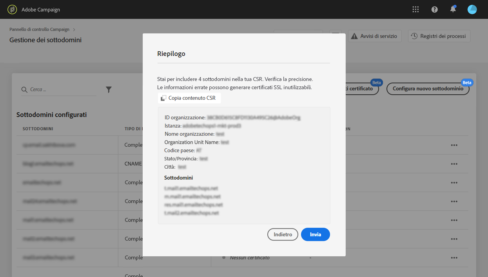
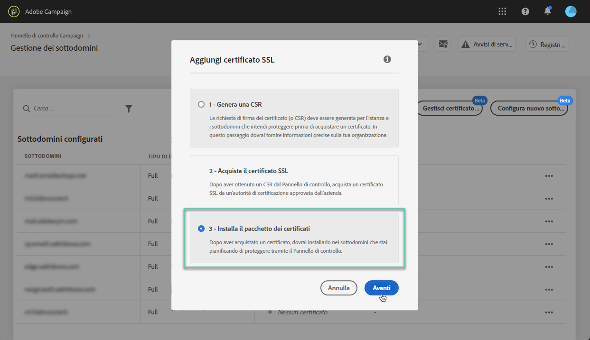
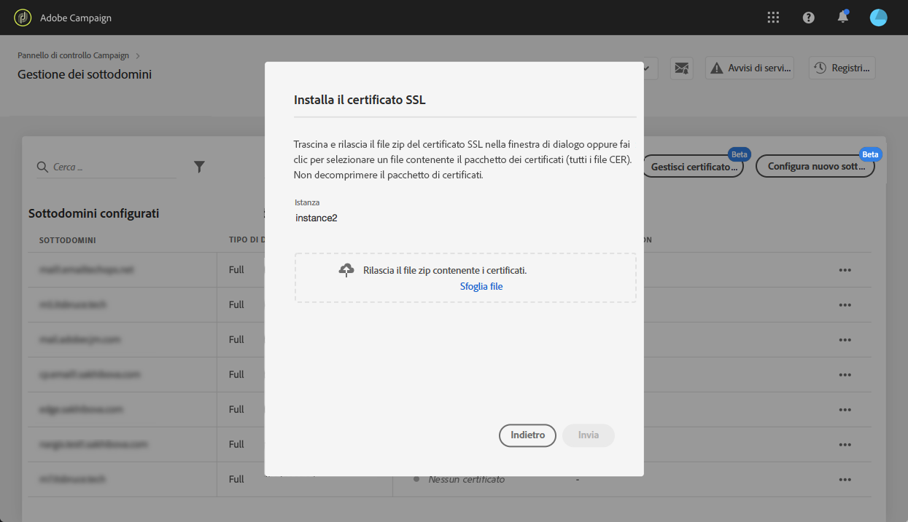

# Rinnovo del certificato SSL di un sottodominio {#renewing-subdomains-ssl-certificates}

>[!CONTEXTUALHELP]
>id="cp_add_ssl_certificate"
>title="Aggiungere un certificato SSL"
>abstract="Per aggiungere un certificato SSL, devi generare una richiesta di firma del certificato (CSR, Certificate Signing Request), acquistare il certificato SSL per i tuoi sottodomini e installare il Bundle certificati."
>additional-url="https://docs.adobe.com/content/help/it-IT/control-panel/using/subdomains-and-certificates/renewing-subdomain-certificate.html#generating-csr" text="Generazione di una richiesta di firma del certificato (CSR, Certificate Signing Request)"
>additional-url="https://docs.adobe.com/content/help/it-IT/control-panel/using/subdomains-and-certificates/renewing-subdomain-certificate.html#installing-ssl-certificate" text="Come installare un certificato SSL"

## Informazioni sul rinnovo dei certificati {#about-certificate-renewal-process}

>[!IMPORTANT]
>
>La configurazione del sottodominio del Pannello di controllo Campaign è disponibile in versione beta e soggetta a frequenti aggiornamenti e modifiche senza preavviso.

Il processo di rinnovo del certificato SSL comprende 3 passaggi:

1. **Generazione della richiesta di firma del certificato (CSR, Certificate Signing Request)**
L’Assistenza clienti Adobe genera una CSR per te. Per generare la CSR dovrai fornire alcune informazioni (ad esempio nome comune, nome e indirizzo dell’organizzazione, ecc.).
1. **Acquisto del certificato SSL**
Una volta generata la CSR, è possibile scaricarla e utilizzarla per acquistare il certificato SSL dall’autorità di certificazione approvata dalla tua azienda.
1. **Installazione del certificato SSL**
Una volta acquistato il certificato SSL, puoi installarlo nel sottodominio desiderato.

 Scoprite questa funzione nel video con [Campaign Classic](https://experienceleague.adobe.com/docs/campaign-classic-learn/control-panel/subdomains-and-certificates/adding-ssl-certificates.html?lang=en#subdomains-and-certificates) o [Campaign Standard](https://experienceleague.adobe.com/docs/campaign-standard-learn/control-panel/subdomains-and-certificates/adding-ssl-certificates.html?lang=en#adding-ssl-certificates)

## Generazione di una richiesta di firma del certificato (CSR, Certificate Signing Request) {#generating-csr}

>[!CONTEXTUALHELP]
>id="cp_generate_csr"
>title="Genera la CSR"
>abstract="La richiesta di firma del certificato (CSR, Certificate Signing Request) deve essere generata per l’istanza e i sottodomini che intendi proteggere prima di acquistare un certificato."

>[!CONTEXTUALHELP]
>id="cp_select_subdomains"
>title="Seleziona i sottodomini per la tua CSR"
>abstract="Puoi scegliere di includere tutti i sottodomini o solo alcuni specifici nella richiesta di firma del certificato. Solo i sottodomini selezionati saranno certificati tramite il certificato SSL acquistato."
>additional-url="https://docs.adobe.com/content/help/it-IT/control-panel/using/subdomains-and-certificates/renewing-subdomain-certificate.html#generating-csr" text="Generazione di una richiesta di firma del certificato (CSR, Certificate Signing Request)"
>additional-url="https://docs.adobe.com/content/help/it-IT/control-panel/using/subdomains-and-certificates/subdomains-branding.html" text="Informazioni sul branding dei sottodomini"

Per generare una richiesta di firma del certificato (CSR, Certificate Signing Request), procedi come segue:

1. Nella scheda **[!UICONTROL Subdomains & Certificates]**, seleziona l’istanza desiderata, quindi fai clic sul pulsante **[!UICONTROL Manage Certificate]**.

   

1. Seleziona **[!UICONTROL 1 - Generate a CSR]**, quindi fai clic su **[!UICONTROL Next]** per avviare la procedura guidata che ti guiderà attraverso il processo di generazione della CSR.

   

1. Viene visualizzato un modulo con tutti i dettagli necessari per generare la CSR.

   Assicurati di inserire le informazioni richieste in modo completo e accurato, altrimenti il certificato potrebbe non essere rinnovato (se necessario, contatta il team interno e i team di sicurezza e IT), quindi fai clic su **[!UICONTROL Next]**.

   * **[!UICONTROL Organization]**: nome ufficiale dell’organizzazione.
   * **[!UICONTROL Organization Unit]**: unità collegata al sottodominio (esempio: Marketing, IT).
   * **[!UICONTROL Instance]** (precompilato): URL dell’istanza Campaign associata al sottodominio.

   

1. Seleziona i sottodomini da includere nella CSR, quindi fai clic su **[!UICONTROL OK]**.

   

1. I sottodomini selezionati vengono visualizzati nell’elenco. Per ciascuno di essi, seleziona i sottodomini da includere, quindi fai clic su **[!UICONTROL Next]**.

   

1. Viene visualizzato un riepilogo dei sottodomini da includere nella CSR. Fai clic su **[!UICONTROL Submit]** per confermare la richiesta.

   

1. Il file .csr corrispondente alla selezione viene generato e scaricato automaticamente. Ora puoi usarlo per acquistare il certificato SSL dall’autorità di certificazione approvata dalla tua azienda.

   >[!NOTE]
   >
   >Se la CSR non viene salvata o scaricata, andrà persa e dovrai generarla di nuovo.

## Acquisto di un certificato con la CSR {#purchasing-certificate}

Dopo aver ottenuto una CSR dal Pannello di controllo Campaign, acquista un certificato SSL da un’autorità di certificazione approvata dalla tua organizzazione.

## Installazione del certificato SSL {#installing-ssl-certificate}

>[!CONTEXTUALHELP]
>id="cp_install_ssl_certificate"
>title="Installa il certificato SSL"
>abstract="Installa il certificato SSL acquistato dall’autorità di certificazione approvata dalla tua organizzazione."
>additional-url="https://docs.adobe.com/content/help/it-IT/control-panel/using/subdomains-and-certificates/subdomains-branding.html" text="Informazioni sul branding dei sottodomini"

Una volta acquistato un certificato SSL, puoi installarlo nell’istanza. Prima di procedere, accertati di conoscere i prerequisiti seguenti:

* La richiesta di firma del certificato (CSR, Certificate Signing Request) deve essere stata generata dal Pannello di controllo Campaign. In caso contrario, non potrai installare il certificato dal Pannello di controllo Campaign.
* La richiesta di firma del certificato (CSR) deve corrispondere al sottodominio configurato per l&#39;utilizzo con  Adobe. Ad esempio, non può contenere più sottodomini di quello configurato.
* Il certificato deve avere una data corrente. Non è possibile installare certificati con date future e non deve essere scaduto (vale a dire date di inizio e fine valide).
* Il certificato deve essere rilasciato da un’autorità di certificazione (CA, Certificate Authority) affidabile, come Comodo, DigiCert, GoDaddy, ecc..
* La dimensione del certificato deve essere di 2048 bit e l’algoritmo deve essere RSA.
* Il certificato deve essere in formato X.509 PEM.
* I certificati SAN sono supportati.
* I certificati con caratteri jolly non sono supportati.
* Il file ZIP o il certificato non devono essere protetti da password.
* Il file ZIP deve contenere solo quanto segue, preferibilmente in singoli file:
   * Certificato dell’entità finale.
   * Catena di certificati intermedi (ordinata in modo corretto).
   * Certificato radice (facoltativo).

Per installare il certificato, effettua le seguenti operazioni:

1. Nella scheda **[!UICONTROL Subdomains & Certificates]**, seleziona l’istanza desiderata, quindi fai clic sul pulsante **[!UICONTROL Manage Certificate]**.

   

1. Seleziona **[!UICONTROL 3 - Install Certificate Bundle]**, quindi fai clic su **[!UICONTROL Next]** per avviare la procedura guidata che ti guiderà attraverso il processo di installazione del certificato.

   

1. Seleziona il file .zip che contiene il certificato da installare, quindi fai clic su **[!UICONTROL Submit]**.

   

>[!NOTE]
>
>Il certificato verrà installato su tutti i domini/sottodomini inclusi nella CSR. Eventuali altri domini/sottodomini presenti nel certificato non saranno presi in considerazione.

Una volta installato il certificato SSL, la data di scadenza e l’icona di stato del certificato vengono aggiornate di conseguenza.

**Argomenti correlati:**

* [Branding dei sottodomini](../../subdomains-certificates/using/subdomains-branding.md)
* [Monitoraggio dei sottodomini](../../subdomains-certificates/using/monitoring-subdomains.md)