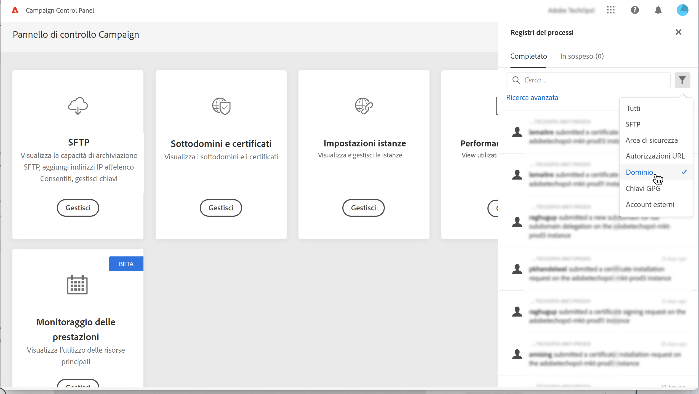

# Rinnovare i certificati SSL {#renewing-subdomains-ssl-certificates}

>[!CONTEXTUALHELP]
>id="cp_add_ssl_certificate"
>title="Rinnovo del certificato SSL"
>abstract="Per rinnovare un certificato SSL, devi generare una richiesta di firma del certificato (CSR, Certificate Signing Request), acquistare il certificato SSL per i tuoi sottodomini e installare il Bundle certificati. Questa operazione è necessaria solo se si è scelto di gestire i certificati manualmente anziché delegarli ad Adobe. "

>[!NOTE]
>
>Il rinnovo dei certificati SSL dei sottodomini è necessario solo se si è scelto di gestire autonomamente i certificati anziché delegare questo processo ad Adobe. Si consiglia vivamente di delegare la gestione dei certificati SSL dei sottodomini ad Adobe, in quanto Adobe creerà automaticamente il certificato e lo rinnoverà ogni anno prima della scadenza. [Ulteriori informazioni sulla gestione dei certificati SSL](monitoring-ssl-certificates.md#management)

Il processo di rinnovo del certificato SSL comprende 3 passaggi:

1. **Generazione della richiesta di firma del certificato (CSR, Certificate Signing Request)**

   La richiesta di firma del certificato (CSR, Certificate Signing Request) deve essere generata per l’istanza e i sottodomini che intendi proteggere prima di acquistare un certificato.  Per generare la CSR dovrai fornire alcune informazioni (ad esempio nome comune, nome e indirizzo dell’organizzazione, ecc.). [Ulteriori informazioni](#generate)

1. **Acquisto del certificato SSL**

   Una volta generata la CSR, puoi utilizzarla per acquistare il certificato SSL dall’autorità di certificazione approvata dalla tua azienda.

1. **Installazione del certificato SSL**

   Installa il certificato SSL acquistato nel sottodominio desiderato per proteggerlo. [Ulteriori informazioni](#install)

 Scopri questa funzione nel video per [Campaign v7/v8](https://experienceleague.adobe.com/docs/campaign-classic-learn/control-panel/subdomains-and-certificates/adding-ssl-certificates.html?lang=it#subdomains-and-certificates) o [Campaign Standard](https://experienceleague.adobe.com/docs/campaign-standard-learn/control-panel/subdomains-and-certificates/adding-ssl-certificates.html?lang=it#adding-ssl-certificates)

**Argomenti correlati:**

* [Guida alle best practice per il recapito messaggi - Processo di richiesta del certificato SSL per Adobe Campaign](https://experienceleague.adobe.com/docs/deliverability-learn/deliverability-best-practice-guide/additional-resources/campaign/ac-ssl-certificate-request.html?lang=it)
* [Branding dei sottodomini](../../subdomains-certificates/using/subdomains-branding.md)
* [Monitoraggio dei sottodomini](../../subdomains-certificates/using/monitoring-subdomains.md)

## Generare la CSR {#generate}

>[!CONTEXTUALHELP]
>id="cp_generate_csr"
>title="Generazione di CSR"
>abstract="La richiesta di firma del certificato (CSR, Certificate Signing Request) deve essere generata per l’istanza e i sottodomini che intendi proteggere prima di acquistare un certificato."

>[!CONTEXTUALHELP]
>id="cp_select_subdomains"
>title="Seleziona i sottodomini per la tua CSR"
>abstract="Puoi scegliere di includere tutti i sottodomini o solo alcuni specifici nella richiesta di firma del certificato. Solo i sottodomini selezionati saranno certificati tramite il certificato SSL acquistato."

Per generare una richiesta di firma del certificato (CSR, Certificate Signing Request), procedi come segue:

1. Nella scheda **[!UICONTROL Subdomains & Certificates]**, seleziona l’istanza desiderata, quindi fai clic sul pulsante **[!UICONTROL Manage Certificate]**.

   

1. Seleziona **[!UICONTROL 1 - Generate a CSR]**, quindi fai clic su **[!UICONTROL Next]** per avviare la procedura guidata che ti guiderà attraverso il processo di generazione della CSR.

   

1. Viene visualizzato un modulo con tutti i dettagli necessari per generare la CSR.

   Assicurati di inserire le informazioni richieste in modo completo e accurato, altrimenti il certificato potrebbe non essere rinnovato (se necessario, contatta il team interno e i team di sicurezza e IT), quindi fai clic su **[!UICONTROL Next]**.

   * **[!UICONTROL Organization]**: nome ufficiale dell’organizzazione.
   * **[!UICONTROL Organization Unit]**: unità collegata al sottodominio (esempio: Marketing, IT).
   * **[!UICONTROL Instance]** (precompilato): URL dell’istanza Campaign associata al sottodominio.
   * **[!UICONTROL Common name]**: il nome comune è selezionato per impostazione predefinita, se necessario puoi selezionare uno dei sottodomini.

   

1. Seleziona i sottodomini da includere nella CSR, quindi fai clic su **[!UICONTROL OK]**.

   

1. I sottodomini selezionati vengono visualizzati nell’elenco. Per ciascuno di essi, seleziona i sottodomini da includere, quindi fai clic su **[!UICONTROL Next]**.

   

1. Viene visualizzato un riepilogo dei sottodomini da includere nella CSR. Fai clic su **[!UICONTROL Submit]** per confermare la richiesta.

   

   >[!NOTE]
   >
   >Il pulsante **[!UICONTROL Copy CSR content]** consente di copiare tutte le informazioni relative alla CSR (ID organizzazione, istanza, nome organizzazione, nome comune, sottodomini inclusi, ecc.)

1. Il file .csr corrispondente alla selezione viene generato e scaricato automaticamente. Ora puoi usarlo per acquistare il certificato SSL dall’autorità di certificazione approvata dalla tua azienda. Se devi scaricare nuovamente la CSR, segui i passaggi descritti in [questa sezione](#download).

Una volta generata e scaricata la CSR, puoi utilizzarla per acquistare un certificato SSL da un’autorità di certificazione approvata dalla tua organizzazione.

Dopo aver acquistato il certificato SSL, potrai installarlo nell’istanza per proteggere il sottodominio. [Ulteriori informazioni](#install)

## Scaricare la CSR {#download}

Per acquistare un certificato SSL, devi innanzitutto scaricare la richiesta di firma del certificato (CSR). La CSR viene scaricata automaticamente dopo essere stata generata. Inoltre, puoi scaricarla nuovamente in qualsiasi momento dai Registri dei processi:

1. In **[!UICONTROL Job Logs]**, seleziona la scheda **[!UICONTROL Finished]**, quindi filtra l’elenco per visualizzare i processi relativi alla gestione dei sottodomini.

   

1. Apri il processo corrispondente alla generazione della CSR, quindi fai clic sul collegametno **[!UICONTROL Downbload]** per ottenere il file .csr.

   

## Installare il certificato SSL {#install}

>[!CONTEXTUALHELP]
>id="cp_install_ssl_certificate"
>title="Installazione del certificato SSL"
>abstract="Installa il certificato SSL acquistato dall’autorità di certificazione approvata dalla tua organizzazione."

Una volta acquistato un certificato SSL, puoi installarlo nell’istanza. Prima di procedere, accertati di conoscere i prerequisiti seguenti:

* La richiesta di firma del certificato (CSR, Certificate Signing Request) deve essere stata generata dal Pannello di controllo. In caso contrario, non potrai installare il certificato dal Pannello di controllo.
* La richiesta di firma del certificato (CSR) deve corrispondere al sottodominio che è stato configurato per funzionare con Adobe. Ad esempio, non può contenere altri sottodomini oltre a quello che è stato configurato.
* Il certificato deve avere una data corrente. Non è possibile installare certificati con date future e non deve essere scaduto (vale a dire date di inizio e fine valide).
* Il certificato deve essere rilasciato da un’autorità di certificazione (CA, Certificate Authority) affidabile, come Comodo, DigiCert, GoDaddy, ecc..
* La dimensione del certificato deve essere di 2048 bit e l’algoritmo deve essere RSA.
* Il certificato deve essere in formato X.509 PEM.
* I certificati SAN sono supportati.
* I certificati con caratteri jolly non sono supportati.
* Il file ZIP o il certificato non devono essere protetti da password.
* Il file ZIP deve contenere solo quanto segue, preferibilmente in singoli file:
   * Certificato dell’entità finale.
   * Catena di certificati intermedi (ordinata in modo corretto).
   * Certificato radice (facoltativo).

Per installare il certificato, effettua le seguenti operazioni:

1. Nella scheda **[!UICONTROL Subdomains & Certificates]**, seleziona l’istanza desiderata, quindi fai clic sul pulsante **[!UICONTROL Manage Certificate]**.

   

1. Seleziona **[!UICONTROL 3 - Install Certificate Bundle]**, quindi fai clic su **[!UICONTROL Next]** per avviare la procedura guidata che ti guiderà attraverso il processo di installazione del certificato.

   

1. Seleziona il file .zip che contiene il certificato da installare, quindi fai clic su **[!UICONTROL Submit]**.

   

>[!NOTE]
>
>Il certificato verrà installato su tutti i domini/sottodomini inclusi nella CSR. Eventuali altri domini/sottodomini presenti nel certificato non saranno presi in considerazione.

Una volta installato il certificato SSL, la data di scadenza e l’icona di stato del certificato vengono aggiornate di conseguenza.
