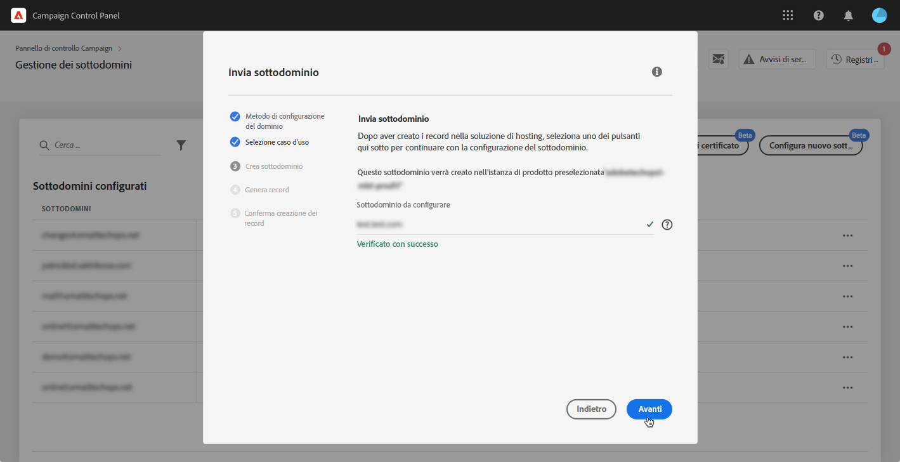

# Configurazione di un nuovo sottodominio {#setting-up-subdomain}

>[!CONTEXTUALHELP]
>id="cp_subdomain_management"
>title="Configurare nuovi sottodomini e gestire certificati"
>abstract="Devi impostare un nuovo sottodominio e gestire i certificati SSL dei tuoi sottodomini per iniziare a inviare e-mail o pubblicare pagine di destinazione con Adobe Campaign."
>additional-url="https://docs.adobe.com/content/help/it-IT/control-panel/using/subdomains-and-certificates/monitoring-ssl-certificates.html" text="Come monitorare i certificati SSL dei sottodomini"

## Must-read {#must-read}

>[!IMPORTANT]
>
>La configurazione del sottodominio del Pannello di controllo Campaign è disponibile in versione beta e soggetta a frequenti aggiornamenti e modifiche senza preavviso.

Questa pagina fornisce informazioni su come impostare nuovi sottodomini utilizzando la delega di sottodominio completo o CNAME. I concetti globali relativi a questi due metodi sono presentati in questa sezione: [Marchio dei sottodomini](../../subdomains-certificates/using/subdomains-branding.md).

**Argomento correlato:**

* [Monitoraggio dei sottodomini](../../subdomains-certificates/using/monitoring-subdomains.md)

### Selezione dell&#39;istanza

La configurazione del sottodominio è disponibile solo per le istanze **produzione**.

Se l&#39;istanza selezionata nella procedura guidata non dispone di sottodomini configurati in precedenza, il primo sottodominio configurato diventerà il **sottodominio primario** per tale istanza e non sarà possibile modificarlo in futuro.

Di conseguenza, **record DNS inversi** verranno creati per altri sottodomini che utilizzano questo sottodominio primario. **Gli indirizzi di risposta e mancato recapito per altri sottodomini verranno generati dal sottodominio principale.**

### Configurazione dei server dei nomi

Durante la configurazione dei server dei nomi, accertati di **non delegare il sottodominio principale ad Adobe**. In caso contrario, il dominio potrà funzionare solo con Adobe. Qualsiasi altro utilizzo sarà impossibile, ad esempio l’invio di e-mail interne ai dipendenti della tua azienda.

Inoltre, **non creare un file di zona separato** per il nuovo sottodominio.

## Delega di sottodomini completa {#full-subdomain-delegation}

Per delegare completamente un sottodominio a  Adobe Campaign, attenetevi alla procedura seguente.

 Scopri questa funzione nel video tramite  [Campaign ](https://experienceleague.adobe.com/docs/campaign-classic-learn/control-panel/subdomains-and-certificates/subdomain-delegation.html?lang=en#subdomains-and-certificates) Classicor  [Campaign Standard](https://experienceleague.adobe.com/docs/campaign-standard-learn/control-panel/subdomains-and-certificates/subdomain-delegation.html?lang=en#subdomains-and-certificates)

1. Nella scheda **[!UICONTROL Subdomains & Certificates]**, seleziona l’istanza di produzione desiderata, quindi fai clic su **[!UICONTROL Setup new subdomain]**.

   

1. Fai clic su **[!UICONTROL Next]** per confermare il metodo di delega completa.

   

1. Crea il sottodominio e i server di nomi desiderati nella soluzione di hosting utilizzata dalla tua organizzazione. A questo scopo, copia e incolla le informazioni del server dei nomi Adobe visualizzate nella procedura guidata. Per ulteriori informazioni su come creare un sottodominio in una soluzione di hosting, guarda il [video tutorial](https://video.tv.adobe.com/v/30175?captions=ita).

   

1. Una volta creato il sottodominio con le informazioni corrispondenti del server dei nomi Adobe, fai clic su **[!UICONTROL Next]**.

1. Se avete selezionato un’istanza di Campaign Classic, selezionate il caso di utilizzo desiderato per il sottodominio: **Comunicazioni di marketing** o **Comunicazioni transazionali e operative**. I concetti globali sui casi di utilizzo dei sottodomini sono presentati in [questa sezione](../../subdomains-certificates/using/subdomains-branding.md#about-subdomains-use-cases).

   

1. Immetti il sottodominio creato nella tua soluzione di hosting, quindi fai clic su **[!UICONTROL Submit]**.

   Accertati di inserire il **nome completo** del sottodominio da delegare. Ad esempio, per delegare il sottodominio “usoffer.email.weretail.com”, digita “usoffer.email.weretail.com”.

   

Dopo l&#39;invio del sottodominio, il Pannello di controllo Campaign eseguirà vari controlli e passaggi di configurazione. Per ulteriori informazioni, vedere [Controlli e configurazione del sottodominio](#subdomain-checks-and-configuration).

## Configurazione di sottodomini tramite CNAME {#use-cnames}

Per configurare un sottodominio utilizzando i CNAME, attenetevi alla procedura seguente.

 Scopri questa funzione nel video tramite  [Campaign ](https://experienceleague.adobe.com/docs/campaign-classic-learn/control-panel/subdomains-and-certificates/delegating-subdomains-using-cname.html?lang=en#subdomains-and-certificates) Classicor  [Campaign Standard](https://experienceleague.adobe.com/docs/campaign-standard-learn/control-panel/subdomains-and-certificates/delegating-subdomains-using-cname.html?lang=en)

1. Nella scheda **[!UICONTROL Subdomains & Certificates]**, seleziona l’istanza di produzione desiderata, quindi fai clic su **[!UICONTROL Setup new subdomain]**.

   

1. Selezionare il metodo **[!UICONTROL CNAME]**, quindi fare clic su **[!UICONTROL Next]**.

   

1. Se avete selezionato un’istanza di Campaign Classic, selezionate il caso di utilizzo desiderato per il sottodominio: **Comunicazioni di marketing** o **Comunicazioni transazionali e operative**. I concetti globali sui casi di utilizzo dei sottodomini sono presentati in [questa sezione](../../subdomains-certificates/using/subdomains-branding.md#about-subdomains-use-cases).

   

1. Immetti il sottodominio creato nella tua soluzione di hosting, quindi fai clic su **[!UICONTROL Next]**.

   Assicurarsi di compilare il **nome completo** del sottodominio da configurare. Ad esempio, per configurare il sottodominio &quot;usoffer.email.weretail.com&quot;, digitate &quot;usoffer.email.weretail.com&quot;.

   

1. Viene visualizzato l&#39;elenco dei record da inserire nei server DNS. Copiate questi record, uno per uno, o scaricando un file CSV, quindi andate alla soluzione di hosting del dominio per generare i record DNS corrispondenti.

   

1. Accertatevi che tutti i record DNS dai passaggi precedenti siano stati generati nella soluzione di hosting del dominio. Se tutto è configurato correttamente, selezionate la prima istruzione, quindi fate clic su **[!UICONTROL Submit]** per confermare.

   

   >[!NOTE]
   >
   >Se si desidera creare i record e inviare la configurazione del sottodominio in un secondo momento, selezionare la seconda istruzione, quindi fare clic su **[!UICONTROL Submit later]**. Sarà quindi possibile riprendere la configurazione del sottodominio direttamente dall&#39;area **[!UICONTROL Processing]** della schermata di gestione del sottodominio.
   >
   >I record DNS da inserire nel server verranno conservati entro 30 Pannelli di controllo Campaign. Oltre tale periodo, sarà necessario configurare il sottodominio da zero.

Dopo l&#39;invio del sottodominio, il Pannello di controllo Campaign eseguirà vari controlli e passaggi di configurazione. Per ulteriori informazioni, vedere [Controlli e configurazione del sottodominio](#subdomain-checks-and-configuration).

## Controlli e configurazione del sottodominio {#subdomain-checks-and-configuration}

1. Dopo l&#39;invio di un sottodominio, il Pannello di controllo Campaign verificherà che esso indichi correttamente  record NS del Adobe e che il record di avvio dell&#39;Autorità (SOA) non esista per questo sottodominio.

   >[!NOTE]
   >
   >Durante l&#39;esecuzione della configurazione del sottodominio, altre richieste effettuate attraverso il Pannello di controllo Campaign verranno inserite in una coda ed eseguite solo al termine della configurazione del sottodominio, per evitare problemi di prestazioni.

1. Se i controlli hanno esito positivo, il Pannello di controllo Campaign avvia la configurazione del sottodominio con record DNS, URL aggiuntivi, caselle in entrata e così via.

   

   Per ottenere ulteriori dettagli sull&#39;avanzamento della configurazione, fare clic sul pulsante di configurazione del sottodominio **[!UICONTROL Details]**.

   

1. Successivamente, il **team di Adobe Deliverability** verrà informato del nuovo sottodominio al fine di sottoporlo ad audit. Il processo di controllo può richiedere fino a 10 giorni lavorativi dopo la configurazione del sottodominio.

   >[!IMPORTANT]
   >
   >I controlli di recapito che vengono eseguiti includono cicli di feedback e cicli di reclamo spam. Sconsigliamo quindi di utilizzare il sottodominio prima che l’audit sia stato completato, in quanto potrebbe portare a una cattiva reputazione del sottodominio.

1. Al termine del processo, i sottodomini saranno configurati per lavorare con l’istanza Adobe Campaign e verranno creati gli elementi seguenti:

   * **Il sottodominio con i seguenti record DNS**: SOA, MX, CNAME, DKIM, SPF, TXT,
   * **Sottodomini aggiuntivi** per ospitare mirror, risorse, pagine di tracciamento e chiave di dominio,
   * **Caselle in entrata**: Sender, Error, Reply-to (Mittente, Errore, Risposta).

   Per impostazione predefinita, la casella in entrata “Reply-to” (“Risposta”) del Pannello di controllo Campaign è configurata per cancellare le e-mail e non si può esaminare. Se desideri monitorare la casella in entrata “Reply-to” (“Risposta”) per le tue campagne di marketing, non utilizzare questo indirizzo.

Per ottenere ulteriori dettagli sul sottodominio, fai clic sui pulsanti **[!UICONTROL Subdomain details]** e **[!UICONTROL Sender info]**.

## Risoluzione dei problemi {#troubleshooting}

* In alcuni casi, la configurazione del sottodominio viene implementata, ma il sottodominio potrebbe non essere stato verificato correttamente. Il sottodominio resterà nell’elenco **[!UICONTROL Configured]** con un job log che fornisce informazioni sull’errore. In caso di difficoltà nella risoluzione del problema, contatta l’Assistenza clienti.
* Se il sottodominio viene visualizzato come “Unverified” (Non verificato) dopo la configurazione, avvia una nuova verifica del sottodominio (**...** / **[!UICONTROL Verify subdomain]**). Se viene ancora mostrato lo stesso stato, ciò potrebbe essere dovuto al fatto che è stata eseguita una personalizzazione sullo schema dei destinatari che non può essere verificata con i processi standard. Prova ad avviare una campagna con quel sottodominio.
* Se la configurazione del sottodominio richiede troppo tempo (più di 10 giorni lavorativi) durante il passaggio dell’audit del recapito di messaggi, contatta l’Assistenza clienti.
