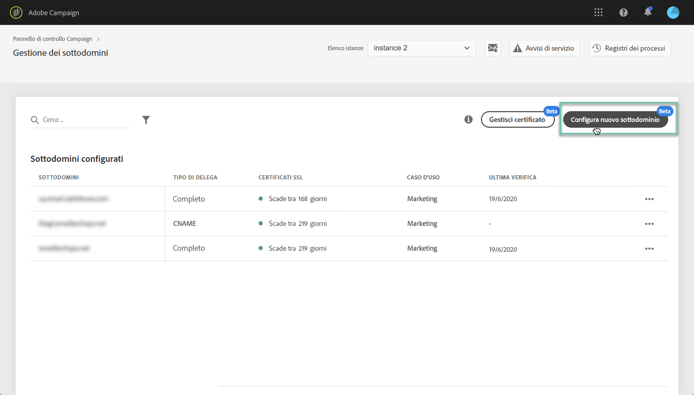
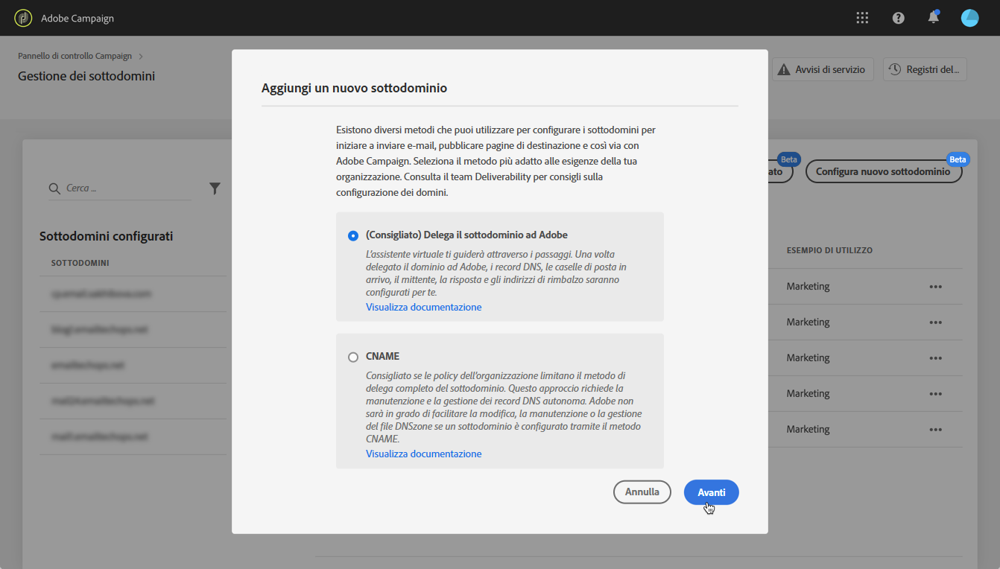
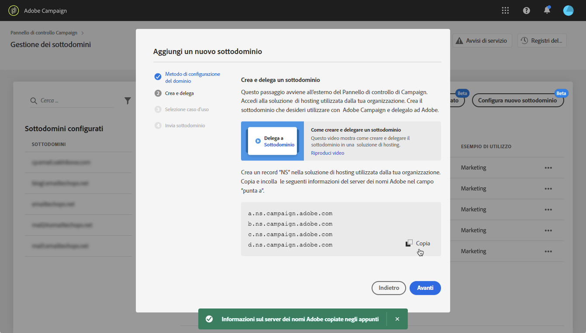
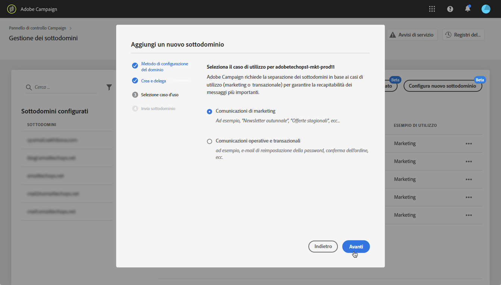
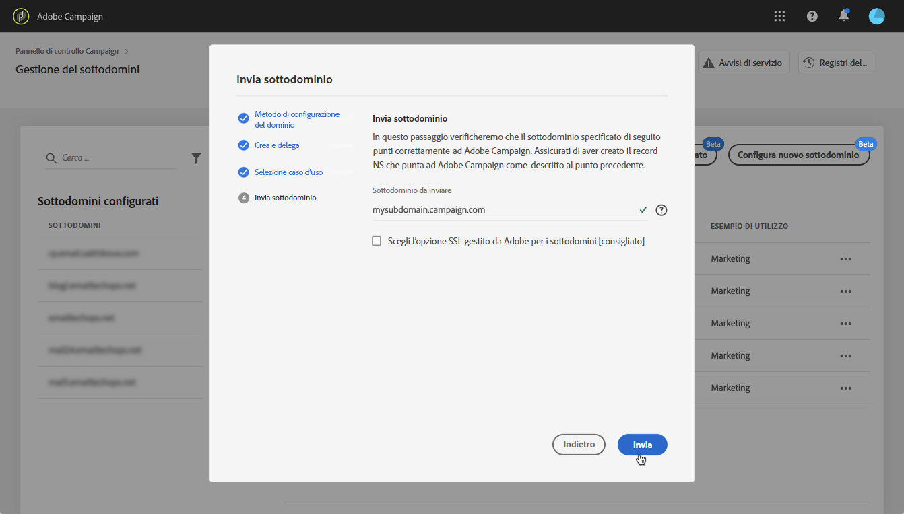
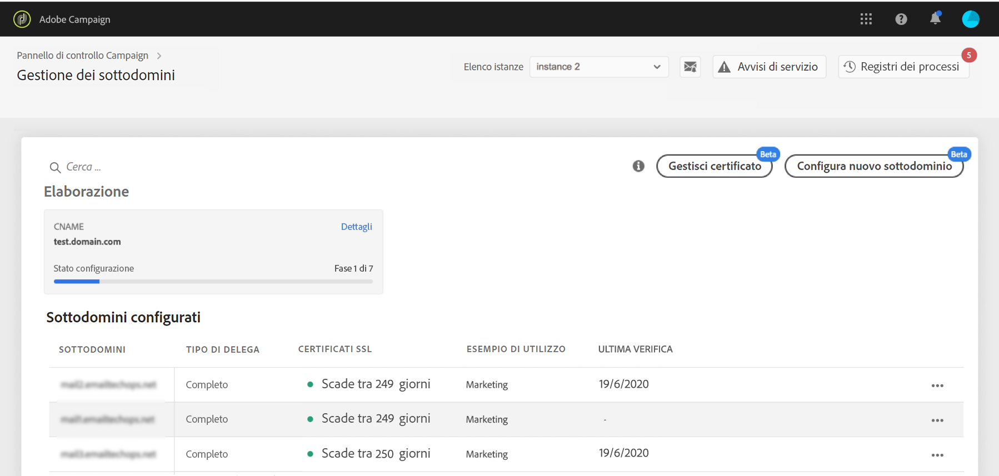
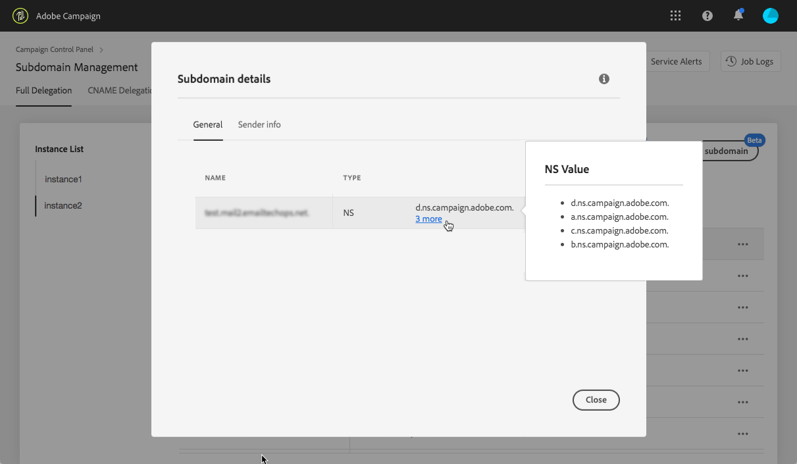

# Impostazione di un nuovo sottodominio {#setting-up-subdomain}

>[!CONTEXTUALHELP]
>id=&quot;cp_subdomain_management&quot;
>title=&quot;Imposta nuovi sottodomini e gestisci certificati&quot;
>abstract=&quot;È necessario impostare un nuovo sottodominio e gestire i certificati SSL dei sottodomini per iniziare a inviare e-mail o pubblicare pagine di destinazione con Adobe Campaign.&quot;
>Additional-url=&quot;https://docs.adobe.com/content/help/en/control-panel/using/subdomains-and-certificates/monitoring-ssl-certificates.html&quot; text=&quot;Come monitorare i certificati SSL dei sottodomini&quot;

>[!IMPORTANT]
>
>La delega di sottodominio del Pannello di controllo è disponibile in versione beta e soggetta a frequenti aggiornamenti e modifiche senza preavviso.

## Delega di sottodomini completa {#full-subdomain-delegation}

Il Pannello di controllo consente di delegare completamente un sottodominio ad Adobe Campaign. A questo scopo, attenetevi alla procedura indicata di seguito.

>[!NOTE]
>
>Se l&#39;istanza selezionata non dispone di sottodomini configurati in precedenza, il primo sottodominio delegato ad Adobe diventerà il sottodominio **** principale per tale istanza, non sarà possibile modificarlo in futuro.
>
>I record DNS inversi verranno creati per altri sottodomini utilizzando il sottodominio primario. Gli indirizzi di risposta e rimbalzo per altri sottodomini verranno generati dal sottodominio primario.

1. Nella **[!UICONTROL Subdomains & Certificates]** scheda, selezionate l&#39;istanza di produzione desiderata, quindi fate clic su **[!UICONTROL Setup new subdomain]**.

   

   >[!NOTE]
   >
   >La delega del sottodominio è disponibile solo per le istanze di **produzione** .

1. Fare clic **[!UICONTROL Next]** per confermare il metodo di delega completo.

   

   >[!NOTE]
   >
   >[I metodi CNAME](#use-cnames) e personalizzati non sono attualmente supportati dal Pannello di controllo.

1. Create il sottodominio e i server di nomi desiderati nella soluzione di hosting utilizzata dalla vostra organizzazione. A questo scopo, copiate e incollate le informazioni di Adobe Nameserver visualizzate nella procedura guidata. Per ulteriori informazioni su come creare un sottodominio in una soluzione di hosting, consulta il video [di](https://video.tv.adobe.com/v/30175?captions=ita)esercitazione.

   >[!IMPORTANT]
   >
   >Durante la configurazione dei server dei nomi, accertati di **non delegare il sottodominio principale ad Adobe**. In caso contrario, il dominio potrà funzionare solo con Adobe. Qualsiasi altro utilizzo sarà impossibile, ad esempio l&#39;invio di e-mail interne ai dipendenti dell&#39;azienda.
   >
   >Inoltre, **non creare un file** di area separato per il nuovo sottodominio.

   

   Una volta creato il sottodominio con le informazioni corrispondenti del server dei nomi Adobe, fate clic su **[!UICONTROL Next]**.

1. Selezionare il caso di utilizzo desiderato per il sottodominio:

   * **Comunicazioni** di marketing: comunicazioni destinate a scopi commerciali. Esempio: campagna e-mail di vendita.
   * **Comunicazioni** operative e transazionali: le comunicazioni transazionali contengono informazioni volte a completare un processo avviato dal destinatario. Esempio: conferma dell&#39;acquisto, e-mail di reimpostazione della password. Le comunicazioni organizzative riguardano lo scambio di informazioni, idee e opinioni all&#39;interno e all&#39;esterno dell&#39;organizzazione, senza scopo commerciale.
   

   **Suddividere i sottodomini in base ai casi di utilizzo è una procedura consigliata per la recapito**. In questo modo, la reputazione di ciascun sottodominio è isolata e protetta. Ad esempio, se il tuo sottodominio per le comunicazioni di marketing finirà per essere inserito in blacklist dai provider di servizi Internet, il sottodominio delle comunicazioni transazionali non subentrerà e continuerà a essere in grado di inviare comunicazioni.

   **Puoi delegare un sottodominio sia per i casi** di utilizzo Marketing che per quelli Transazionali:

   * Per i casi di utilizzo di Marketing, i sottodomini saranno configurati sulle istanze **MID** (Mid sourcing).
   * Per i casi di utilizzo transazionali, i sottodomini saranno configurati su tutte le istanze di **RT** (Message Center / Real-time messaging) per garantire la connettività. I sottodomini quindi funzioneranno con tutte le tue istanze RT.
   >[!NOTE]
   >
   >Se utilizzate Campaign Classic, il Pannello di controllo consente di vedere quali istanze RT/MID sono collegate all&#39;istanza Marketing con cui state lavorando. For more on this, refer to [this section](../../instances-settings/using/instance-details.md).

1. Immettete il sottodominio creato nella soluzione di hosting, quindi fate clic su **[!UICONTROL Submit]**.

   Accertatevi di compilare il nome **** completo del sottodominio da delegare. Ad esempio, per delegare il sottodominio &quot;usoffer.email.weretail.com&quot;, digitare &quot;usoffer.email.weretail.com&quot;.

   

1. Dopo l&#39;invio del sottodominio, il Pannello di controllo verificherà che esso punti correttamente ai record Adobe NS e che il record Start of Authority (SOA) non esista per questo sottodominio.

1. Se i controlli vengono eseguiti correttamente, il Pannello di controllo avvia la configurazione del sottodominio con record DNS, URL aggiuntivi, inbox e così via. Per maggiori dettagli sull’avanzamento della configurazione, fai clic sul **[!UICONTROL Process details]** pulsante .

   

   >[!NOTE]
   >
   >In alcuni casi, la delega viene eseguita, ma il sottodominio potrebbe non essere stato verificato. Il sottodominio entrerà direttamente nell&#39; **[!UICONTROL Verified subdomains]** elenco con lo **[!UICONTROL Unverified]** stato e un registro di processo che fornisce informazioni sull&#39;errore. In caso di problemi con la risoluzione del problema, contatta l’Assistenza clienti.
   >
   >Durante l&#39;esecuzione della delega di sottodominio, altre richieste tramite il Pannello di controllo verranno inserite in una coda ed eseguite solo al termine della delega di sottodominio, per evitare problemi di prestazioni.

Al termine del processo, i sottodomini saranno configurati per lavorare con l&#39;istanza Adobe Campaign e verranno creati gli elementi seguenti:

* **Il sottodominio** con i seguenti record **** DNS: SOA, MX, CNAME(s), DKIM, SPF, TXT,
* **Sottodomini** aggiuntivi per mirror host, risorse, pagine di tracciamento e chiave di dominio,
* **Caselle** in entrata: Mittente, Errore, Risposta.

>[!NOTE]
>
>Per impostazione predefinita, la casella in entrata &quot;Rispondi a&quot; del Pannello di controllo è configurata per cancellare le e-mail e non è possibile visualizzarle. Se desideri monitorare la casella in entrata &quot;Rispondi a&quot; per le tue campagne di marketing, non utilizzare questo indirizzo.

Per ottenere ulteriori dettagli sul sottodominio, fare clic sul **[!UICONTROL Subdomain Details]** pulsante.

>[!IMPORTANT]
>
>Al termine della fase di elaborazione, è necessario verificare con l&#39;Assistenza clienti Adobe che sia stata inoltrata una richiesta di audit affinché il team di recapito effettui il controllo del nuovo sottodominio creato. Il processo di audit può richiedere fino a 3 10 giorni lavorativi dopo la delega del sottodominio.
>
>I controlli eseguiti includono cicli di feedback e cicli di reclamo spam. Pertanto non si consiglia di utilizzare il sottodominio prima che l&#39;audit sia stato completato, in quanto potrebbe portare a una cattiva reputazione del sottodominio.

## Utilizzo dei CNAME {#use-cnames}

L’utilizzo di CNAME per la delega di sottodominio non è supportato dal Pannello di controllo. Per utilizzare questo metodo, contatta l’Assistenza clienti Adobe.

**Argomenti correlati:**

* [Delega di sottodomini (video di esercitazione)](https://docs.adobe.com/content/help/en/campaign-learn/campaign-standard-tutorials/administrating/control-panel/subdomain-delegation.html)
* [Marchio dei sottodomini](../../subdomains-certificates/using/subdomains-branding.md)
* [Monitoraggio dei sottodomini](../../subdomains-certificates/using/monitoring-subdomains.md)