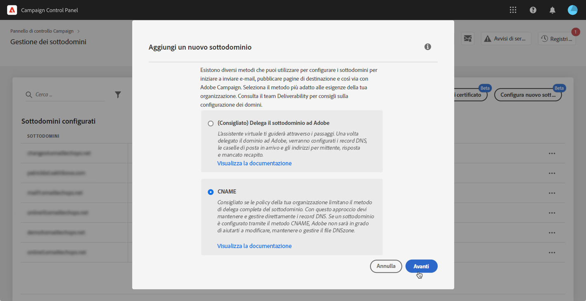
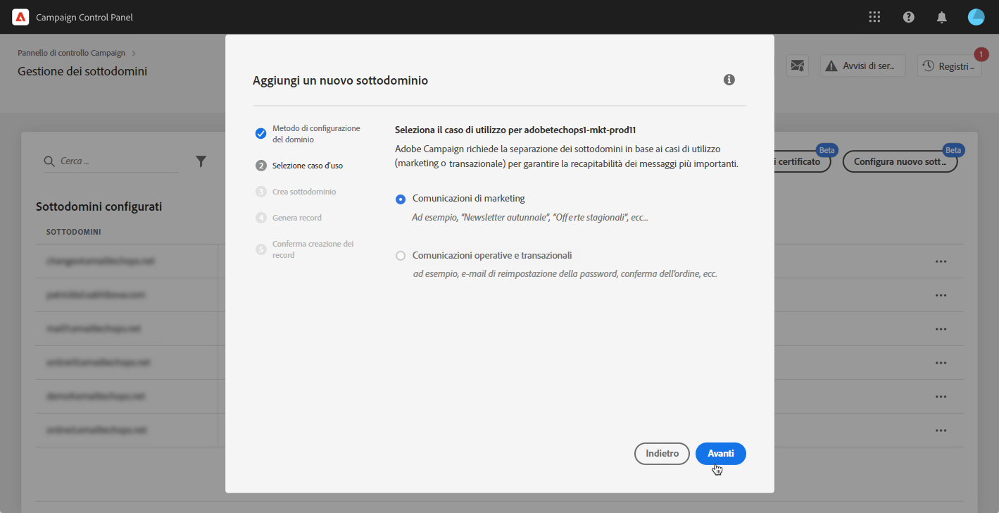
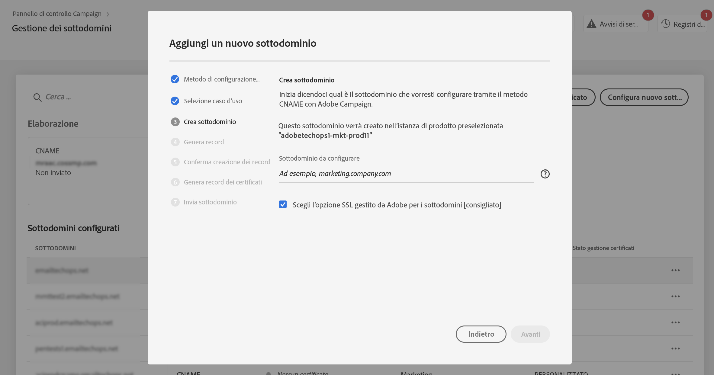
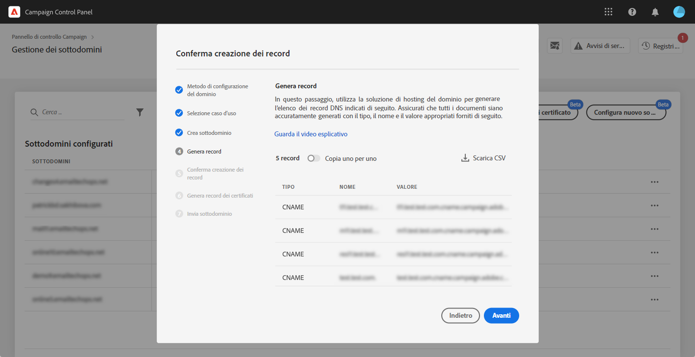
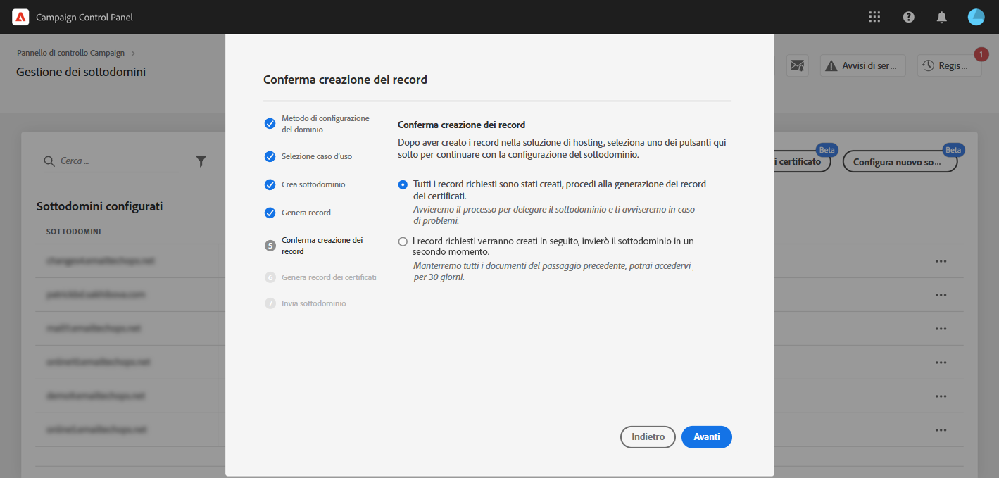
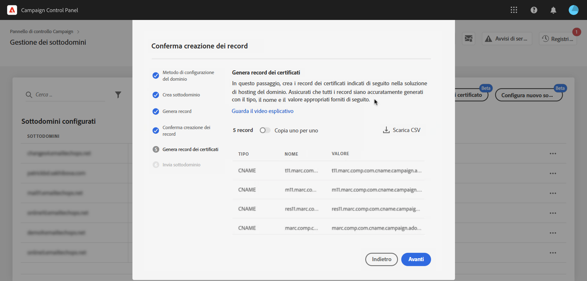
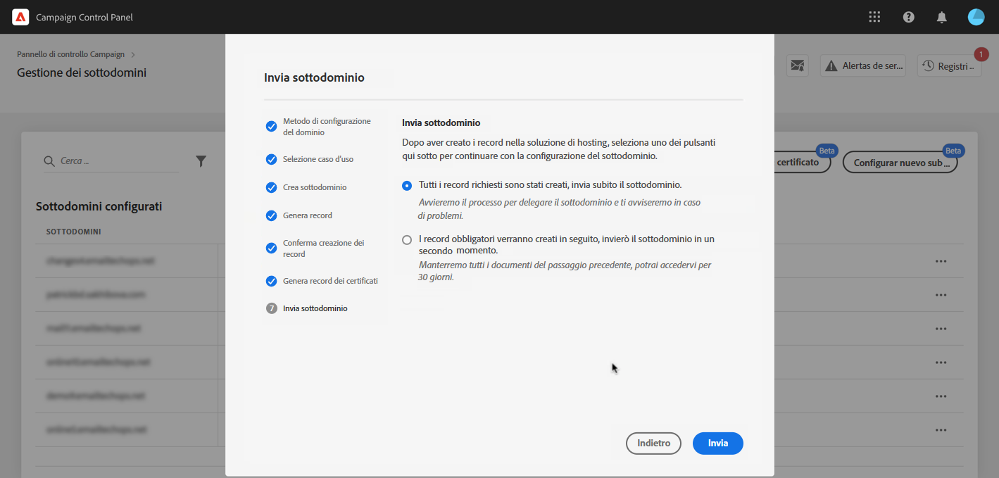

# Configurazione di un nuovo sottodominio {#setting-up-subdomain}

>[!CONTEXTUALHELP]
>id="cp_subdomain_management"
>title="Configurare nuovi sottodomini e gestire certificati"
>abstract="Devi impostare un nuovo sottodominio e gestire i certificati SSL dei tuoi sottodomini per iniziare a inviare e-mail o pubblicare pagine di destinazione con Adobe Campaign."
>additional-url="https://experienceleague.adobe.com/docs/control-panel/using/subdomains-and-certificates/monitoring-ssl-certificates.html?lang=it" text="Monitoraggio dei certificati SSL"

## Da leggere {#must-read}

Questa pagina fornisce informazioni su come impostare nuovi sottodomini utilizzando la delega completa dei sottodomini o CNAME. I concetti globali su questi due metodi sono descritti in questa sezione: [Branding dei sottodomini](../../subdomains-certificates/using/subdomains-branding.md).

**Argomento correlato:**

* [Monitoraggio dei sottodomini](../../subdomains-certificates/using/monitoring-subdomains.md)

### Selezione di un’istanza

La configurazione del sottodominio è disponibile solo per le istanze di **produzione**.

Se l’istanza selezionata nella procedura guidata non dispone di sottodomini già configurati in precedenza, il primo sottodominio configurato diventerà il **sottodominio primario** per tale istanza e non sarà possibile modificarlo in futuro. Di conseguenza, per altri sottodomini che utilizzano questo sottodominio primario verranno creati **record DNS inversi**. **Gli indirizzi di risposta e mancato recapito** per altri sottodomini verranno generati dal sottodominio principale.

### Delegare i certificati SSL dei sottodomini ad Adobe

Quando imposti un nuovo sottodominio, puoi far gestire il certificato SSL da Adobe. Si consiglia vivamente, in quanto Adobe creerà automaticamente il certificato e lo rinnoverà ogni anno prima della scadenza.

Se utilizzi i CNAME per impostare una delega di sottodominio, Adobe fornirà i record del certificato da utilizzare nella soluzione di hosting del dominio per generare il certificato.

>[!NOTE]
>
>L’SSL gestito da Adobe è una funzione gratuita disponibile per gli utenti. [Ulteriori informazioni sulla gestione dei certificati SSL](monitoring-ssl-certificates.md#management)

### Configurazione dei server dei nomi

Durante la configurazione dei server dei nomi, accertati di **non delegare il sottodominio principale ad Adobe**. In caso contrario, il dominio potrà funzionare solo con Adobe. Qualsiasi altro utilizzo sarà impossibile, ad esempio l’invio di e-mail interne ai dipendenti della tua azienda.

Inoltre, **non creare un file di zona separato** per il nuovo sottodominio.

## Delega di sottodomini completa {#full-subdomain-delegation}

>[!CONTEXTUALHELP]
>id="cp_add_new_subdomain"
>title="Aggiungi nuovo sottodominio"
>abstract="Adobe consiglia la delega completa del sottodominio. Tuttavia, puoi utilizzare CNAME o un metodo personalizzato per impostare i sottodomini."
>additional-url="https://experienceleague.adobe.com/docs/control-panel/using/subdomains-and-certificates/setting-up-new-subdomain.html?lang=it" text="Configurazione di un nuovo sottodominio"
>additional-url="https://helpx.adobe.com/it/enterprise/using/support-for-experience-cloud.html" text="Contattare l’Assistenza clienti"

>[!CONTEXTUALHELP]
>id="cp_add_subdomain_create_delegate"
>title="Creare e delegare il sottodominio"
>abstract="Crea il sottodominio che desideri utilizzare con Adobe Campaign nella tua soluzione di hosting e delegalo ad Adobe."
>additional-url="https://experienceleague.adobe.com/docs/control-panel/using/subdomains-and-certificates/setting-up-new-subdomain.html?lang=it" text="Configurazione di un nuovo sottodominio"

>[!CONTEXTUALHELP]
>id="cp_add_subdomain_submit"
>title="Invia il sottodominio"
>abstract="Conferma e invia il sottodominio configurato nei passaggi precedenti."
>additional-url="https://experienceleague.adobe.com/docs/control-panel/using/subdomains-and-certificates/setting-up-new-subdomain.html?lang=it" text="Configurazione di un nuovo sottodominio"

Per delegare completamente un sottodominio ad Adobe Campaign, effettua le seguenti operazioni.

 Scopri questa funzione nel video per [Campaign v7/v8](https://experienceleague.adobe.com/docs/campaign-classic-learn/control-panel/subdomains-and-certificates/subdomain-delegation.html?lang=it#subdomains-and-certificates) o [Campaign Standard](https://experienceleague.adobe.com/docs/campaign-standard-learn/control-panel/subdomains-and-certificates/subdomain-delegation.html?lang=it#subdomains-and-certificates)

1. Nella scheda **[!UICONTROL Subdomains & Certificates]**, seleziona l’istanza di produzione desiderata, quindi fai clic su **[!UICONTROL Setup new subdomain]**.

   

1. Fai clic su **[!UICONTROL Next]** per confermare il metodo di delega completa.

   

1. Crea il sottodominio e i server di nomi desiderati nella soluzione di hosting utilizzata dalla tua organizzazione. A questo scopo, copia e incolla le informazioni del server dei nomi Adobe visualizzate nella procedura guidata. Per ulteriori informazioni su come creare un sottodominio in una soluzione di hosting, guarda il [video tutorial](https://video.tv.adobe.com/v/30175).

   >[!NOTE]
   >
   > Per Adobe Campaign Standard, i sottodomini delegati ti consentiranno di inviare comunicazioni **Marketing** e **Transazionali**.

   

1. Una volta creato il sottodominio con le informazioni corrispondenti del server dei nomi Adobe, fai clic su **[!UICONTROL Next]**.

1. Se hai selezionato un’istanza di Campaign v7/v8, seleziona il caso d’uso desiderato per il sottodominio: **Comunicazioni di marketing** o **Comunicazioni operative e transazionali**. I concetti globali sui casi di utilizzo dei sottodomini sono descritti in [questa sezione](../../subdomains-certificates/using/subdomains-branding.md#about-subdomains-use-cases).

   

1. Immetti il sottodominio creato nella tua soluzione di hosting, quindi fai clic su **[!UICONTROL Submit]**.

   Accertati di inserire il **nome completo** del sottodominio da delegare. Ad esempio, per delegare il sottodominio “usoffer.email.weretail.com”, digita “usoffer.email.weretail.com”.

1. Per delegare ad Adobe la generazione del certificato SSL del sottodominio, abilita **[!UICONTROL Opt for Adobe managed SSL for sub-domains]** opzione. [Ulteriori informazioni sulla delega dei certificati SSL](delegate-ssl.md)

   

Una volta inviato il sottodominio, il Pannello di controllo eseguirà vari controlli e passaggi di configurazione. Per ulteriori informazioni, consulta [Controlli e configurazione dei sottodomini](#subdomain-checks-and-configuration).

## Configurazione dei sottodomini tramite CNAME {#use-cnames}

>[!CONTEXTUALHELP]
>id="cp_add_cname_subdomain_create_delegate"
>title="Configurare il sottodominio"
>abstract="In questa schermata, specifica il sottodominio da configurare utilizzando i CNAME."
>additional-url="https://experienceleague.adobe.com/docs/control-panel/using/subdomains-and-certificates/setting-up-new-subdomain.html?lang=it" text="Configurazione di un nuovo sottodominio"

>[!CONTEXTUALHELP]
>id="cp_add_cname_records"
>title="Generare record"
>abstract="Passa alla soluzione di hosting per generare l’elenco dei record DNS mostrati in questa schermata."
>additional-url="https://experienceleague.adobe.com/docs/control-panel/using/subdomains-and-certificates/setting-up-new-subdomain.html?lang=it" text="Configurazione di un nuovo sottodominio"

>[!CONTEXTUALHELP]
>id="cp_add_cname_subdomain_submit"
>title="Invia il sottodominio"
>abstract="Conferma e invia il sottodominio configurato nei passaggi precedenti."
>additional-url="https://experienceleague.adobe.com/docs/control-panel/using/subdomains-and-certificates/setting-up-new-subdomain.html?lang=it" text="Configurazione di un nuovo sottodominio"

Per configurare un sottodominio utilizzando i CNAME, segui i passaggi riportati di seguito.

 Scopri questa funzione nel video per [Campaign v7/v8](https://experienceleague.adobe.com/docs/campaign-classic-learn/control-panel/subdomains-and-certificates/delegating-subdomains-using-cname.html?lang=it#subdomains-and-certificates) o [Campaign Standard](https://experienceleague.adobe.com/docs/campaign-standard-learn/control-panel/subdomains-and-certificates/delegating-subdomains-using-cname.html?lang=it)

1. Nella scheda **[!UICONTROL Subdomains & Certificates]**, seleziona l’istanza di produzione desiderata, quindi fai clic su **[!UICONTROL Setup new subdomain]**.

   

1. Seleziona il metodo **[!UICONTROL CNAME]** e fai clic su **[!UICONTROL Next]**.

   

1. Se hai selezionato un’istanza di Campaign v7/v8, seleziona il caso d’uso desiderato per il sottodominio: **Comunicazioni di marketing** o **Comunicazioni operative e transazionali**. I concetti globali sui casi di utilizzo dei sottodomini sono descritti in [questa sezione](../../subdomains-certificates/using/subdomains-branding.md#about-subdomains-use-cases).

   

1. Immetti il sottodominio creato nella soluzione di hosting.

   Per delegare ad Adobe la generazione del certificato SSL del sottodominio, abilita **[!UICONTROL Opt for Adobe managed SSL for sub-domains]** opzione. [Ulteriori informazioni sulla delega dei certificati SSL](delegate-ssl.md)

   

   >[!NOTE]
   >
   >Accertati di inserire il **nome completo** del sottodominio da impostare. Ad esempio, per configurare il sottodominio “usoffers.email.weretail.com”, digita “usoffers.email.weretail.com”.

1. Viene visualizzato l’elenco dei record da inserire nei server DNS. Copia questi record, uno per uno, o scaricando un file CSV, quindi accedi alla soluzione di hosting del tuo dominio per generare i record DNS corrispondenti.

   

1. Assicurati che tutti i record DNS dei passaggi precedenti siano stati generati nella soluzione di hosting del tuo dominio. Se tutto è configurato correttamente, seleziona la prima opzione e fai clic su **[!UICONTROL Next]** per confermare.

   Se desideri creare i record e inviare la configurazione del sottodominio in un secondo momento, seleziona la seconda istruzione. Potrai quindi riprendere la configurazione del sottodominio direttamente dalla schermata **[!UICONTROL Processing]**. Tieni presente che i record DNS da inserire nel server verranno conservati per 30 giorni dal Pannello di controllo. Oltre tale periodo, dovrai configurare il sottodominio da zero.

   >[!NOTE]
   >
   >Se hai scelto di non delegare il certificato SSL ad Adobe, questo è l’ultimo passaggio della configurazione del sottodominio. Fai clic sul pulsante **[!UICONTROL Submit]**.

   

1. Se hai scelto di delegare il certificato dei sottodomini ad Adobe, i record dei certificati vengono generati automaticamente. Copia questi record, uno per uno, oppure scaricando un file CSV, quindi accedi alla soluzione di hosting del tuo dominio per generare i certificati corrispondenti.

   

1. Assicurati che tutti i record del certificato siano stati generati nella soluzione di hosting del tuo dominio. Se tutto è configurato correttamente, seleziona la prima opzione e fai clic su **[!UICONTROL Submit]** per confermare.

   

Una volta inviato il sottodominio, il Pannello di controllo eseguirà vari controlli e passaggi di configurazione. Per ulteriori informazioni, consulta [Controlli e configurazione dei sottodomini](#subdomain-checks-and-configuration).

## Controlli e configurazione dei sottodomini {#subdomain-checks-and-configuration}

1. Dopo l’invio del sottodominio, il Pannello di controllo verificherà che esso punti correttamente ai record del server dei nomi Adobe e che il record Origine di autorità (SOA, Start of Authority) non esista per questo sottodominio.

   >[!NOTE]
   >
   >Durante l’esecuzione della configurazione di un sottodominio, altre richieste di Pannello di controllo Campaign verranno inserite in una coda ed eseguite solo al termine della configurazione del sottodominio, per evitare problemi di prestazioni.

1. Se i controlli hanno esito positivo, il Pannello di controllo avvia la configurazione del sottodominio con record DNS, URL aggiuntivi, caselle in entrata e così via.

   

   Per maggiori dettagli sull’avanzamento della configurazione, fai clic sul pulsante di configurazione del sottodominio **[!UICONTROL Details]**.

   

1. Successivamente, il **team di Adobe Deliverability** verrà informato del nuovo sottodominio al fine di sottoporlo ad audit. Il processo di audit può richiedere fino a 10 giorni lavorativi dopo la configurazione del sottodominio.

   >[!IMPORTANT]
   >
   >I controlli di consegna eseguiti includono test di cicli di feedback e cicli di reclamo per posta indesiderata. Sconsigliamo quindi di utilizzare il sottodominio prima che l’audit sia stato completato, in quanto potrebbe portare a una cattiva reputazione del sottodominio.
   >
   >Tuttavia, tieni presente che puoi eseguire operazioni relative ai certificati SSL sul tuo sottodominio, anche se l’audit del recapito messaggi è ancora in elaborazione.

1. Al termine del processo, i sottodomini saranno configurati per lavorare con l’istanza Adobe Campaign e verranno creati gli elementi seguenti:

   * **Il sottodominio con i seguenti record DNS**: SOA, MX, CNAME, DKIM, SPF, TXT,
   * **Sottodomini aggiuntivi** per ospitare mirror, risorse, pagine di tracciamento e chiave di dominio,
   * **Caselle in entrata**: Sender, Error, Reply-to (Mittente, Errore, Risposta).

   Per impostazione predefinita, la casella in entrata “Reply-to” (“Risposta”) del Pannello di controllo è configurata per cancellare le e-mail e non si può esaminare. Se desideri monitorare la casella in entrata “Reply-to” (“Risposta”) per le tue campagne di marketing, non utilizzare questo indirizzo.

Per ottenere ulteriori dettagli sul sottodominio, fai clic sui pulsanti **[!UICONTROL Subdomain details]** e **[!UICONTROL Sender info]**.

## Risoluzione dei problemi {#troubleshooting}

* In alcuni casi, la configurazione viene eseguita, ma il sottodominio potrebbe non superare la verifica. Il sottodominio resterà nell’elenco **[!UICONTROL Configured]** con un job log che fornisce informazioni sull’errore. In caso di difficoltà nella risoluzione del problema, contatta l’Assistenza clienti.
* Se il sottodominio viene visualizzato come “Unverified” (Non verificato) dopo la configurazione, avvia una nuova verifica del sottodominio (**...** / **[!UICONTROL Verify subdomain]**). Se viene ancora mostrato lo stesso stato, ciò potrebbe essere dovuto al fatto che è stata eseguita una personalizzazione sullo schema dei destinatari che non può essere verificata con i processi standard. Prova ad avviare una campagna con quel sottodominio.
* Se la configurazione del sottodominio richiede troppo tempo (più di 10 giorni lavorativi) durante il passaggio dell’audit del recapito di messaggi, contatta l’Assistenza clienti.
