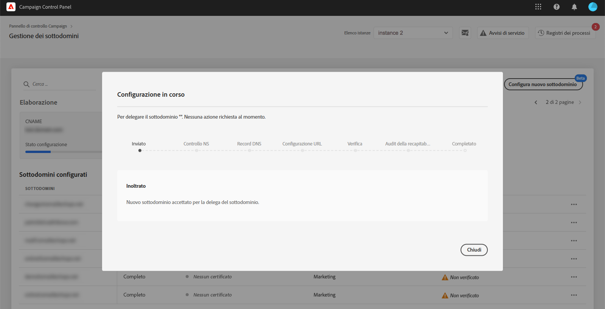
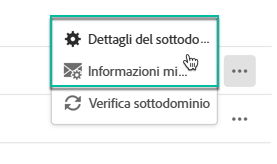
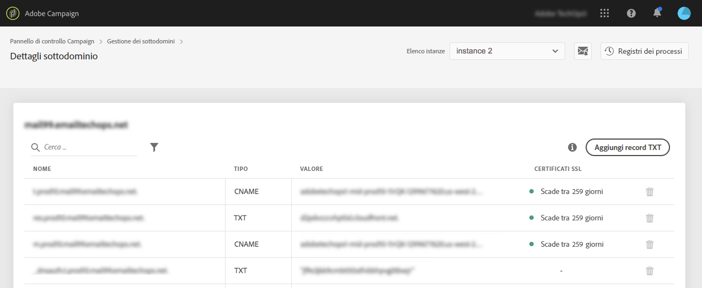
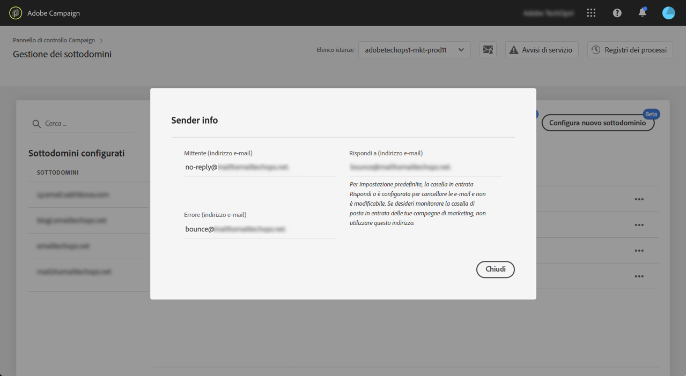

# Configurazione di un nuovo sottodominio {#setting-up-subdomain}

>[!CONTEXTUALHELP]
>id="cp_subdomain_management"
>title="Configurare nuovi sottodomini e gestire certificati"
>abstract="Devi impostare un nuovo sottodominio e gestire i certificati SSL dei tuoi sottodomini per iniziare a inviare e-mail o pubblicare pagine di destinazione con Adobe Campaign."
>additional-url="https://docs.adobe.com/content/help/it-IT/control-panel/using/subdomains-and-certificates/monitoring-ssl-certificates.html" text="Come monitorare i certificati SSL dei sottodomini"

>[!IMPORTANT]
>
>La delega dei sottodomini dal Pannello di controllo Campaign è disponibile in versione beta e soggetta a frequenti aggiornamenti e modifiche senza preavviso.

## Delega di sottodomini completa {#full-subdomain-delegation}

Il Pannello di controllo Campaign ti consente di delegare completamente un sottodominio ad Adobe Campaign. A questo scopo, effettuate le seguenti operazioni:

1. Nella scheda **[!UICONTROL Subdomains & Certificates]**, seleziona l’istanza di produzione desiderata, quindi fai clic su **[!UICONTROL Setup new subdomain]**.

   

   >[!NOTE]
   >
   >La delega del sottodominio è disponibile solo per le istanze di **produzione**.
   >
   >Se l’istanza selezionata non dispone di sottodomini configurati in precedenza, il primo sottodominio delegato ad Adobe diventerà il **sottodominio principale** per tale istanza, non potrai modificarlo in futuro. I record DNS inversi verranno creati per altri sottodomini utilizzando il sottodominio principale. Gli indirizzi di risposta e mancato recapito per altri sottodomini verranno generati dal sottodominio principale.

1. Fai clic su **[!UICONTROL Next]** per confermare il metodo di delega completa.

   Note that [CNAME](#use-cnames) and custom methods are currently not supported by the Control Panel.

   

1. Crea il sottodominio e i server di nomi desiderati nella soluzione di hosting utilizzata dalla tua organizzazione. A questo scopo, copia e incolla le informazioni del server dei nomi Adobe visualizzate nella procedura guidata. Per ulteriori informazioni su come creare un sottodominio in una soluzione di hosting, guarda il [video tutorial](https://video.tv.adobe.com/v/30175?captions=ita).

   >[!IMPORTANT]
   >
   >Durante la configurazione dei server dei nomi, accertati di **non delegare il sottodominio principale ad Adobe**. In caso contrario, il dominio potrà funzionare solo con Adobe. Qualsiasi altro utilizzo sarà impossibile, ad esempio l’invio di e-mail interne ai dipendenti della tua azienda.
   >
   >Inoltre, **non creare un file di zona separato** per il nuovo sottodominio.

   

1. Una volta creato il sottodominio con le informazioni corrispondenti del server dei nomi Adobe, fai clic su **[!UICONTROL Next]**.

1. Seleziona il caso di utilizzo desiderato per il sottodominio:

   * **Comunicazioni di marketing**: comunicazioni destinate a scopi commerciali. Esempio: campagna e-mail di vendita.
   * **Comunicazioni operative e transazionali**: le comunicazioni transazionali contengono informazioni volte a completare un processo avviato dal destinatario. Esempio: conferma dell’acquisto, e-mail di reimpostazione della password. Le comunicazioni organizzative riguardano lo scambio di informazioni, idee e opinioni all’interno e all’esterno dell’organizzazione, senza scopo commerciale.
   

   **Suddividere i sottodomini in base ai casi di utilizzo è una best practice per il recapito di messaggi**. In questo modo, la reputazione di ciascun sottodominio è isolata e protetta. Ad esempio, se il sottodominio per le comunicazioni di marketing viene aggiunto all&#39;elenco dei blocchi dai provider di servizi Internet, il sottodominio delle comunicazioni transazionali non subentrerà e continuerà a essere in grado di inviare comunicazioni.

   **Puoi delegare un sottodominio sia per i casi di utilizzo di marketing che per quelli transazionali**:

   * Per i casi di utilizzo di marketing, i sottodomini saranno configurati sulle istanze **MID** (Mid sourcing).
   * Per i casi di utilizzo transazionali, i sottodomini saranno configurati su TUTTE le istanze **RT** (Message Center / Real-time messaging [Centro messaggi/Messaggistica in tempo reale]) per garantire la connettività. I sottodomini funzioneranno quindi con tutte le tue istanze RT.
   >[!NOTE]
   >
   >Se utilizzi Campaign Classic, il Pannello di controllo Campaign ti consente di visualizzare quali istanze RT/MID sono collegate all’istanza di marketing con cui stai lavorando. Per ulteriori informazioni, consultate la sezione Dettagli  istanza.

1. Immetti il sottodominio creato nella tua soluzione di hosting, quindi fai clic su **[!UICONTROL Submit]**.

   Accertati di inserire il **nome completo** del sottodominio da delegare. Ad esempio, per delegare il sottodominio “usoffer.email.weretail.com”, digita “usoffer.email.weretail.com”.

   

1. Dopo l’invio del sottodominio, il Pannello di controllo Campaign verificherà che esso punti correttamente ai record del server dei nomi Adobe e che il record Origine di autorità (SOA, Start of Authority) non esista per questo sottodominio.

   >[!NOTE]
   >
   >Durante l’esecuzione della delega di sottodominio, altre richieste effettuate tramite il Pannello di controllo Campaign verranno inserite in una coda ed eseguite solo al termine della delega di sottodominio, per evitare problemi di prestazioni.

1. Se i controlli hanno esito positivo, il Pannello di controllo Campaign avvia la configurazione del sottodominio con record DNS, URL aggiuntivi, caselle in entrata e così via.

   

   Alla fine, il team di **recapito** verrà informato del nuovo sottodominio, al fine di controllarlo. Il processo di controllo può richiedere fino a 10 giorni lavorativi dopo la delega del sottodominio. I controlli eseguiti includono test di cicli di feedback e cicli di reclamo posta indesiderata. Sconsigliamo quindi di utilizzare il sottodominio prima che l’audit sia stato completato, in quanto potrebbe portare a una cattiva reputazione del sottodominio.

   Per maggiori dettagli sull’avanzamento della configurazione, fai clic sul pulsante **[!UICONTROL Process details]**.

   

   **Risoluzione dei problemi:**

   * In alcuni casi, la delega viene eseguita, ma il sottodominio potrebbe non essere stato verificato correttamente. Il sottodominio resterà nell&#39; **[!UICONTROL Configured]** elenco con un registro dei processi che fornisce informazioni sull&#39;errore. In caso di difficoltà nella risoluzione del problema, contatta l’Assistenza clienti.
   * Se il sottodominio viene visualizzato come &quot;Non verificato&quot; dopo la configurazione, avvia una nuova verifica del sottodominio (**...** / **[!UICONTROL Verify subdomain]**). Se mostra ancora lo stesso stato, il motivo potrebbe essere che è stata eseguita una certa personalizzazione sullo schema dei destinatari, che non può essere verificata utilizzando i processi standard. Prova a inviare una campagna con quel sottodominio.
   * Se la configurazione del sottodominio richiede troppo tempo (più di 10 giorni lavorativi) al passaggio del controllo della recapito, contattare l&#39;Assistenza clienti.

Al termine del processo, i sottodomini saranno configurati per lavorare con l’istanza Adobe Campaign e verranno creati gli elementi seguenti:

* **Il sottodominio con i seguenti record DNS**: SOA, MX, CNAME, DKIM, SPF, TXT,
* **Sottodomini aggiuntivi** per ospitare mirror, risorse, pagine di tracciamento e chiave di dominio,
* **Caselle in entrata**: Sender, Error, Reply-to (Mittente, Errore, Risposta).

   Per impostazione predefinita, la casella in entrata “Reply-to” (“Risposta”) del Pannello di controllo Campaign è configurata per cancellare le e-mail e non si può esaminare. Se desideri monitorare la casella in entrata “Reply-to” (“Risposta”) per le tue campagne di marketing, non utilizzare questo indirizzo.

Per ottenere ulteriori dettagli sul sottodominio, fai clic sui pulsanti **[!UICONTROL Subdomain details]** e **[!UICONTROL Sender info]**.

## Utilizzo dei CNAME {#use-cnames}

L’utilizzo di CNAME per la delega di sottodominio non è supportato dal Pannello di controllo Campaign. Per utilizzare questo metodo, contatta l’Assistenza clienti Adobe.

**Argomenti correlati:**

* [Delega di sottodomini (video tutorial)](https://docs.adobe.com/content/help/en/campaign-learn/campaign-standard-tutorials/administrating/control-panel/subdomain-delegation.html)
* [Branding dei sottodomini](../../subdomains-certificates/using/subdomains-branding.md)
* [Monitoraggio dei sottodomini](../../subdomains-certificates/using/monitoring-subdomains.md)